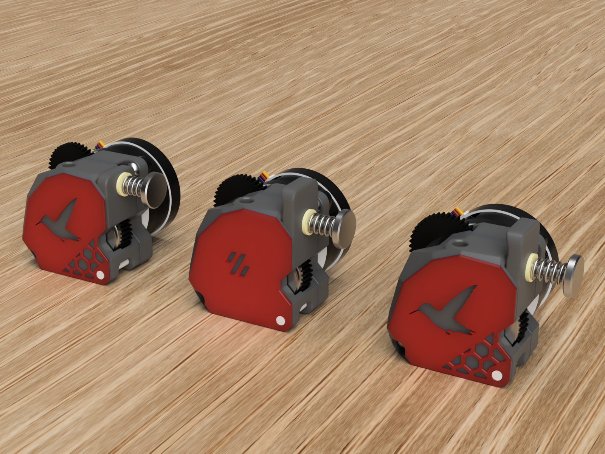
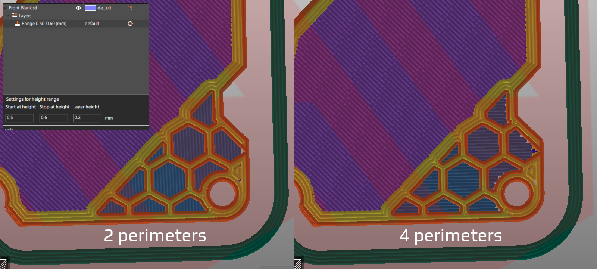
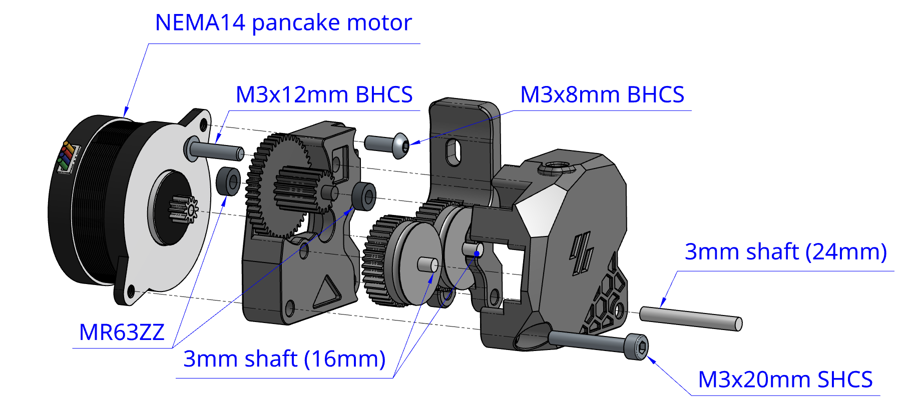
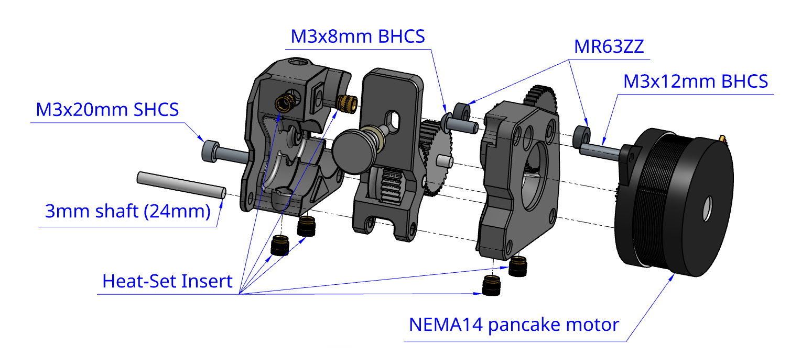
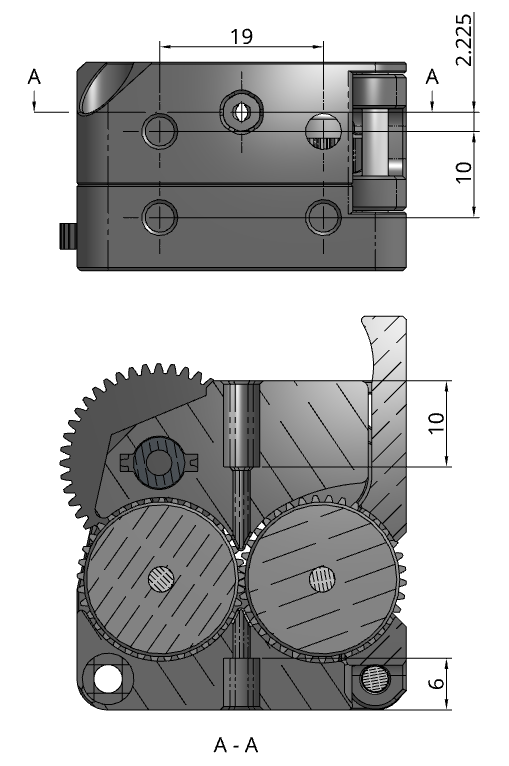
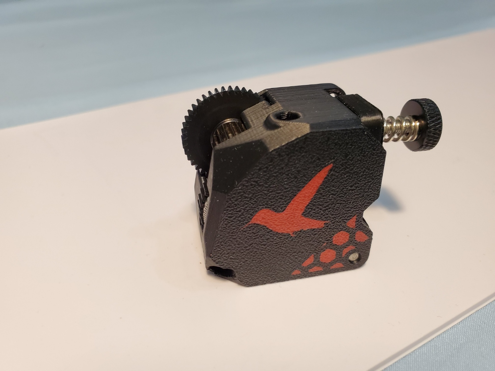
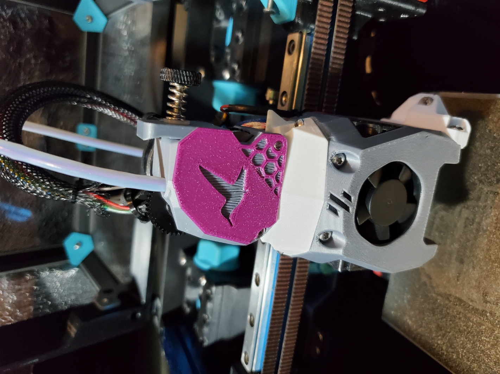
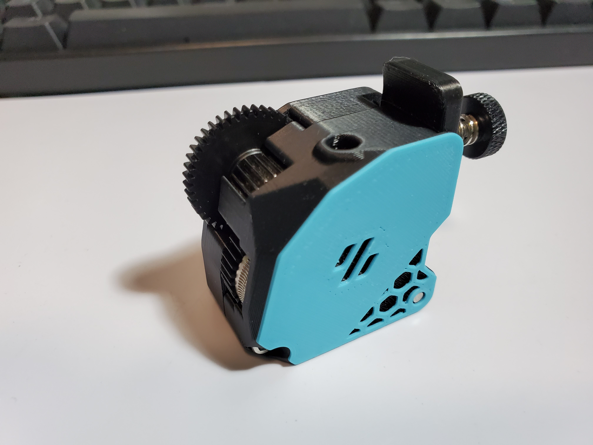
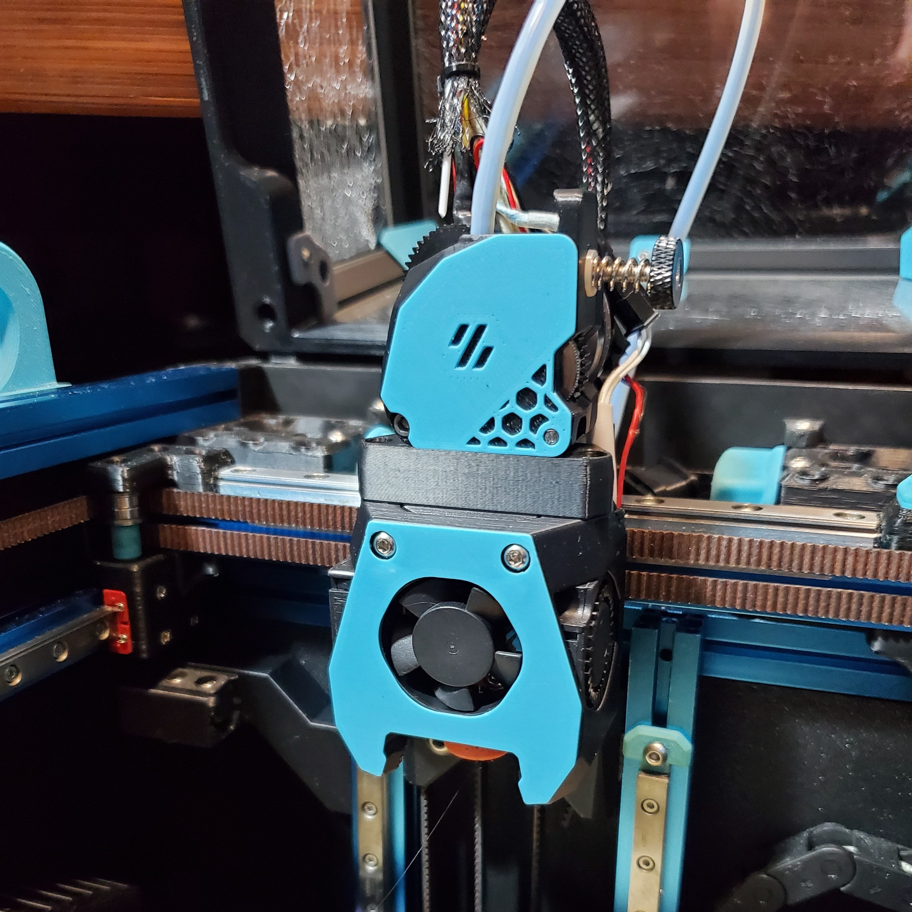

# Hummingbird Extruder



A compact extruder design that has the same form factor and mounting pattern as the [Bondtech LGX Lite](https://www.bondtech.se/product/lgx-lite-large-gears-extruder/).

It utilizes the large extrusion gears of [HGX-lite gear kit](https://www.aliexpress.com/item/1005004699143725.html) to accomplish high gear ratios and good filament grip.

[](https://github.com/nhchiu/VoronMods/blob/main/LICENSE)

## BOM

- HGX Lite extruder gear kit ([https://www.aliexpress.com/item/1005004699143725.html](https://www.aliexpress.com/item/1005004699143725.html))
  - Fasteners:
    - M3x8mm BHCS x 1
    - M3x12mm BHCS x 1
    - M3x20 SHCS x 1
    - Heat set inserts (M3 x D4.5 x H5) x 6
  - MR63ZZ bearings x 2
  - 3mm shaft (16mm length) x 2
  - 3mm shaft (24mm length) x 1
  - Large extrusion gear with pin bearing x 2
  - Reduction gear x 1
- NEMA14 36mm round pancake motor with 10T gear
- A short piece of PTFE tube (4mm OD, 2mm ID)

## Print Settings

Same as Voron spec. 4 perimeters, 40% infill. No support required.

To have the dual color effect as shown in the photo bellow, pause the print at 0.8mm height and change the filament color.

### Tip for bridging over the hexagonal grid

Use a height range modifier at 0.5-0.6 (mm) or add a cube modifier and place it at the height of the bridging, and force the bridging layer to print with only 2 perimeters.



## Assembly





## Key Dimensions

All dimensions are in millimeters.



## Firmware Settings

Only tested on [klipper firmware](https://www.klipper3d.org/):

```ini
[extruder]
rotation_distance: 53.494165  # Re-calibrate your own value
gear_ratio: 44:10, 37:17
```

## Photos









## Changelog

### 2023-06-28

- Added support for 3 kinds of PTFE tube retainers (4mm OD).

### 2023-05-02

- Increased the maximum distance that the idler gear can bite into the filament.
  This should prevent the filament from slipping due to the back pressure in the hotend.
- Made the idler arm thicker so it doesn't get bent over time.
- Added a multi-body STL (with MMU in the filename) for printing on a printer with MMU.

### 2023-04-01

- New hummingbird logo curtesy of #chewy2420 on Discord!
- Added a version without the hexagonal grid for easier print.
- New short idler arm for compact looking (you can still feed the filament by rotating the exposed large gear).
- Removed some plastic and tweaked some dimensions. **No part is compatible with previous versions!**

### 2023-01-13

- Initial release

## Credits and Related Projects

- [Bondtech LGX Lite - Large Gears eXtruder](https://www.bondtech.se/product/lgx-lite-large-gears-extruder/)
- [LGX lite Extruder on Printables](https://www.printables.com/model/282297-lgx-lite-extruder-fdm-case/comments) by [SIVIS](https://www.printables.com/social/263178-sivis)
- **Pixel Printing** on Discord for the name of the extruder
