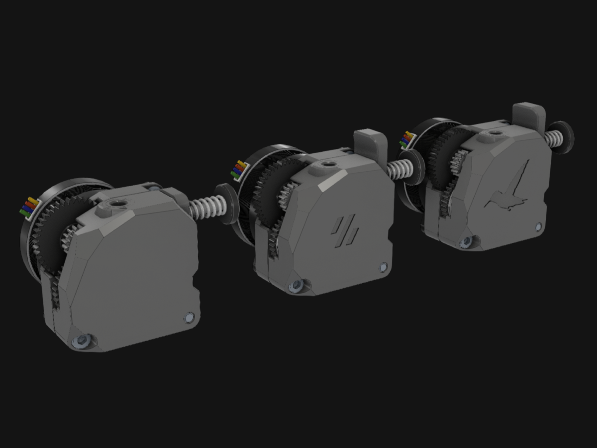
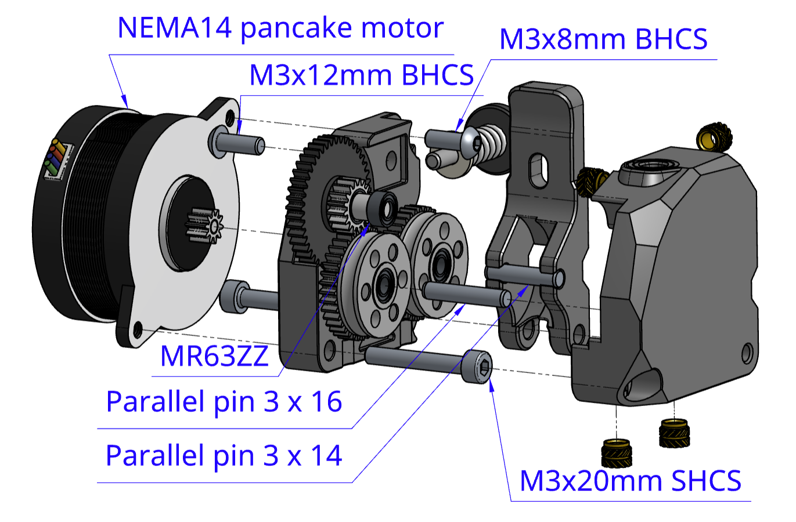
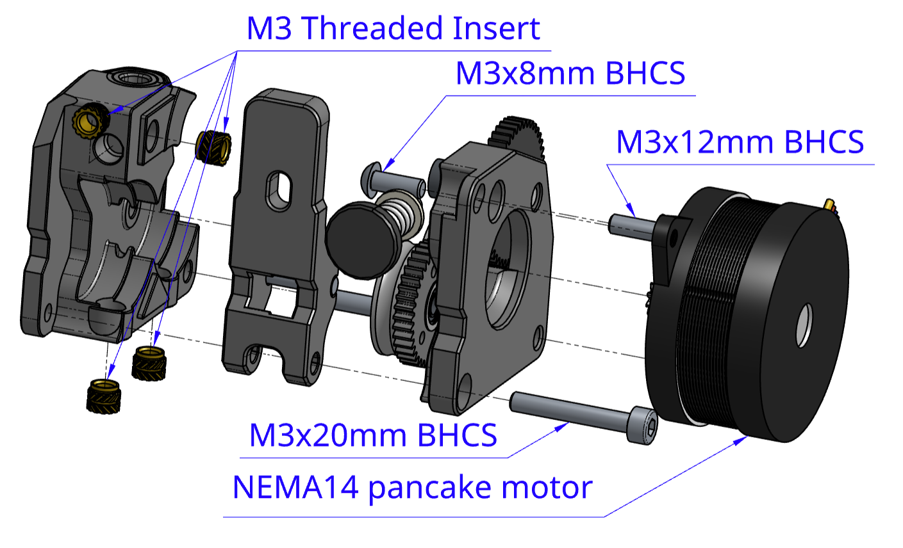
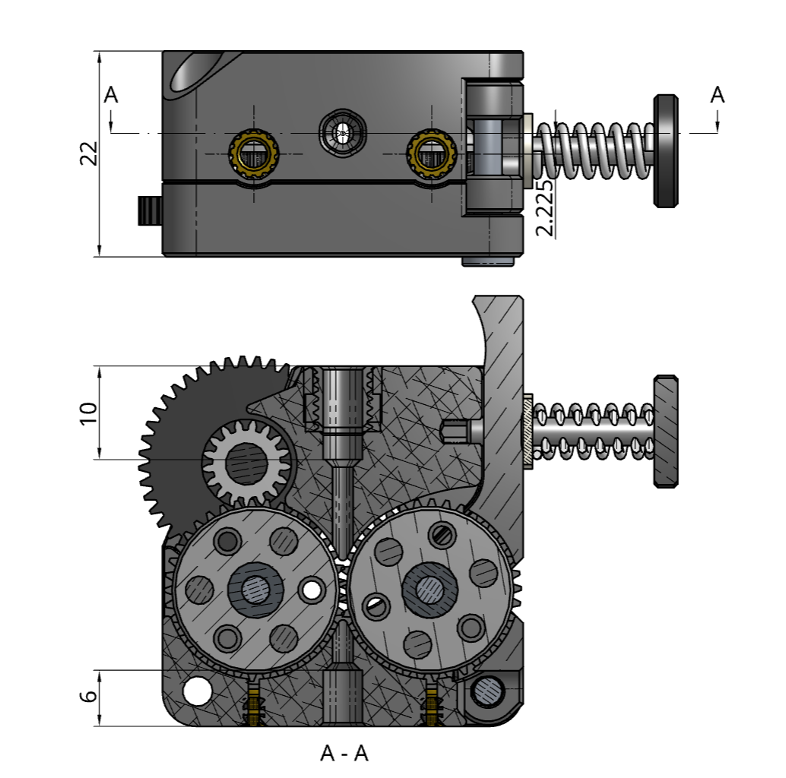
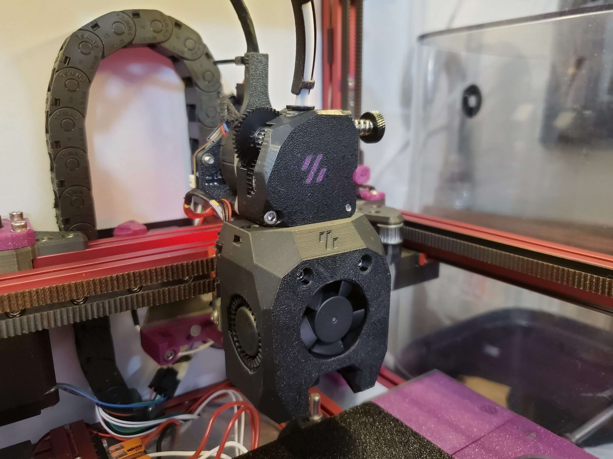

# Hummingbird Extruder 2.0



A compact extruder design that has the same form factor and mounting pattern as the [Bondtech LGX Lite](https://www.bondtech.se/product/lgx-lite-large-gears-extruder/).

Although it is named Hummingbird **2.0**, it's not a direct upgrade from the previous design.
There's not much you can reuse in the BOM.

It utilizes the large extrusion gears of [HGX-lite **2.0** Extruder](https://s.click.aliexpress.com/e/_Dmy9Crl) **(affiliate link)** to accomplish high gear ratios and good filament grip.

If you would like to support my work, the following platforms are available. Thank you!

[](https://ko-fi.com/H2H4FT4J7)
[](https://paypal.me/2nhchiu)

> This page contains affiliate links. If you purchase products through these links, I may earn a small commission at no additional cost to you.
> This helps support the development and maintenance of my projects. Thank you for your support!

[](https://github.com/nhchiu/VoronMods/blob/main/LICENSE)

## BOM

- HGX Lite **2.0** extruder gear kit ([This](https://s.click.aliexpress.com/e/_Dmy9Crl) or [this](https://s.click.aliexpress.com/e/_Dn3gb6n)) **(Both are affiliate links)**.
  - MR63ZZ bearings x 6
  - 3mm shaft (16mm length) x 1
  - 3mm shaft (13mm length) x 1
  - Large extrusion gear x 2
  - Reduction gear x 1
- Fasteners:
  - M3x8mm BHCS x 1
  - M3x12mm BHCS x 1
  - M3x20 SHCS x 2
  - Heat set inserts (M3 x D5 x H4) x 4
- NEMA14 36mm round pancake motor with 10T gear
- A short piece of PTFE tube (4mm OD, 2mm ID)

## Print Settings

Same as Voron spec. 4 perimeters, 40% infill. No support required.

To have the dual color effect as shown in the photo bellow, pause the print at 0.8mm height and change the filament color.

## Assembly





## Key Dimensions

All dimensions are in millimeters.



## Firmware Settings

Only tested on [klipper firmware](https://www.klipper3d.org/):

```ini
[extruder]
rotation_distance: 53.494165  # Re-calibrate your own value
gear_ratio: 44:10, 37:17
```

## Photos



## Changelog

### 2026-08-18

- Initial release
