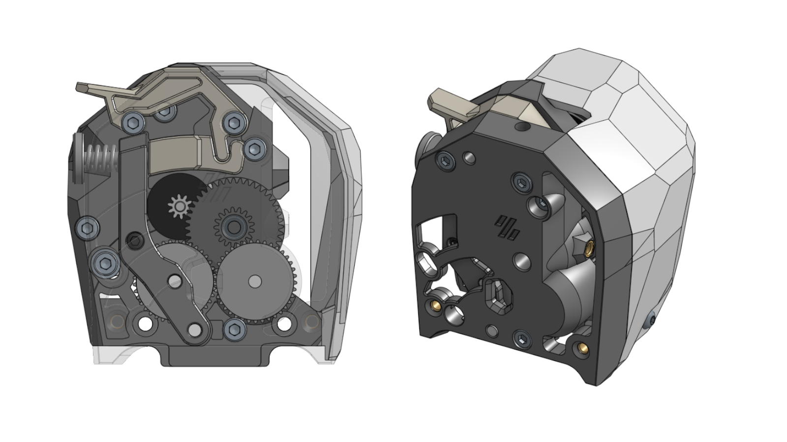
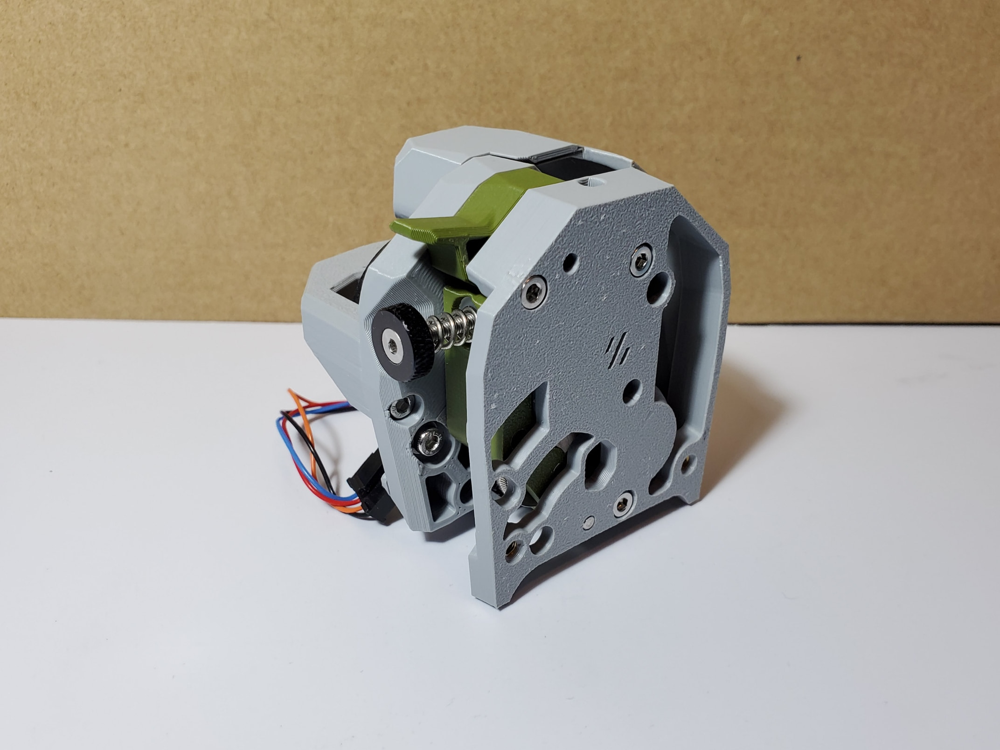
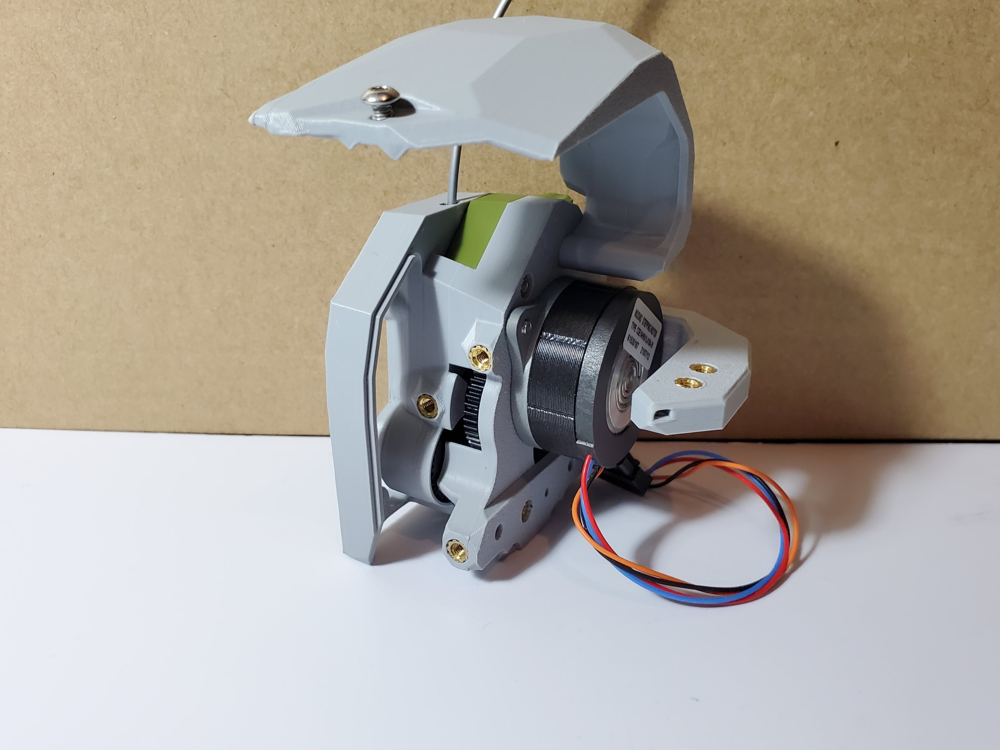
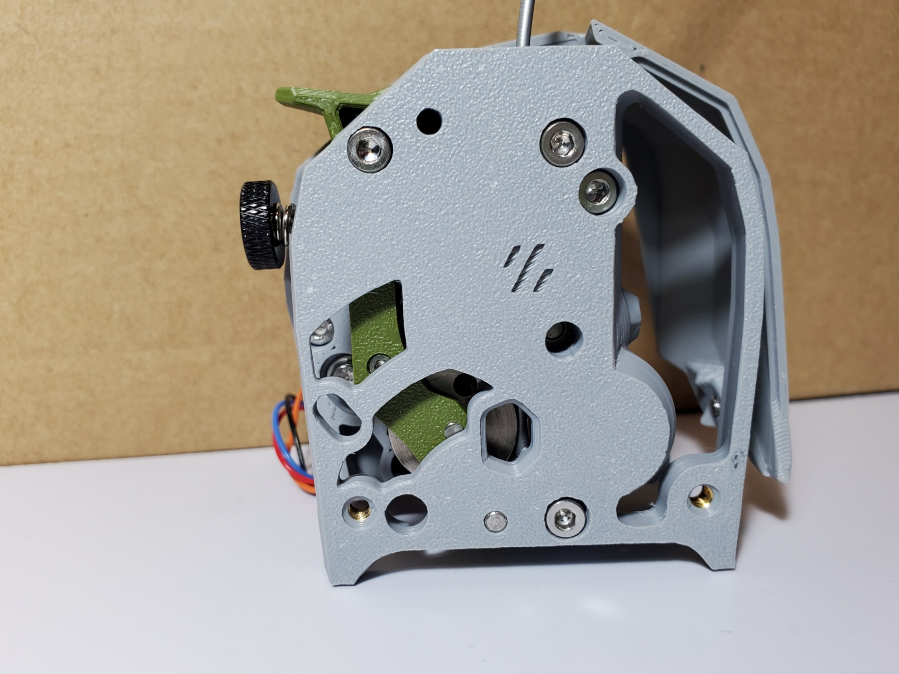
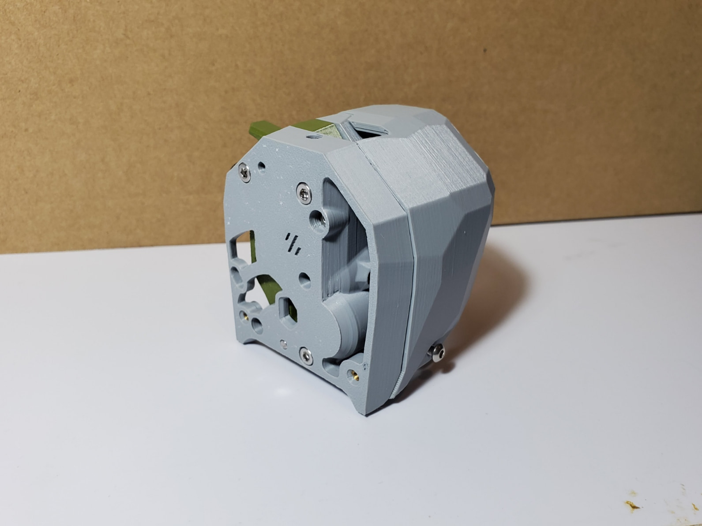

# Large Gear Clockwork2



As title, it's basically [Voron Clockwork2](https://github.com/VoronDesign/Voron-Stealthburner/tree/main/STLs/Clockwork2) utilizing the large extrusion gears of [HGX-lite gear kit](https://www.aliexpress.com/item/1005004699143725.html) or [Bondtech LGX Lite eXtruder](https://www.bondtech.se/product/lgx-lite-large-gears-extruder/) to accomplish high gear ratios and good filament grip.

**If you are going to use a toolhead board, this would probably be only compatible with the 2-piece version of the [Stealthburner toolhead board](https://github.com/VoronDesign/Voron-Hardware/tree/master/Stealthburner_Toolhead_PCB) (mount it directly without the PCB spacer). The standard version will interfere with the gear below. *Check your own toolhead board / CAN board before use!***

[](https://github.com/nhchiu/VoronMods/blob/main/LICENSE)

## BOM

- HGX Lite extruder gear kit ([https://www.aliexpress.com/item/1005004699143725.html](https://www.aliexpress.com/item/1005004699143725.html))
  - MR63ZZ bearings x 2
  - 3mm shaft (16mm length) x 2
  - 3mm shaft (24mm length) x 1
  - Large extrusion gear with pin bearing x 2
  - Reduction gear x 1
- NEMA14 36mm round pancake motor with 10T gear
- Fasteners:
  - M2x10 self-tapping screw x 1
  - M3x6  BHCS x 1
  - M3x8  SHCS x 2
  - M3x16 SHCS x 1
  - M3x20 SHCS x 1
  - M3x25 SHCS x 4
  - M3xD5xH4 threaded inserts x 13 or 14 (depending on the mounting holes of your drag chain)

**Note: Use the threaded inserts in the Voron BOM. The inserts included in the HGX Lite gear kit has a different dimension!**

## Print Settings

Same as Voron spec. 4 perimeters, 40% infill.

All STLs are oriented in the printing orientation. No support required.

## Assembly

Please refer to [Assembly.pdf](./Assembly.pdf).

## Firmware Settings

For [klipper firmware](https://www.klipper3d.org/):

```ini
[extruder]
rotation_distance: 53.494165  # Re-calibrate your own value
gear_ratio: 44:10, 37:17
```

**You have to invert the `dir_pin` of the extruder if you were using a BMG gear kit.**

## Photo









## Changelog

### 2023-07-10

- Increased the maximum squish on the filament.
- Tweaked some dimensions here and there.
- Included a variant using LGX-lite gears.

### 2023-02-20

- Initial release

## Credits

- [Voron Stealthburner and Clockwork2](https://github.com/VoronDesign/Voron-Stealthburner)
- [Bondtech LGX Lite eXtruder](https://www.bondtech.se/product/lgx-lite-large-gears-extruder/)
