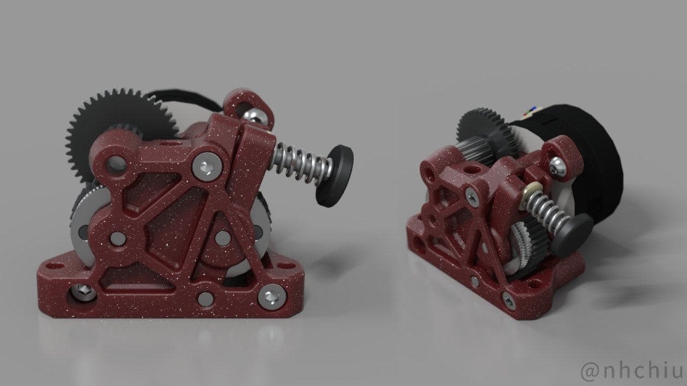
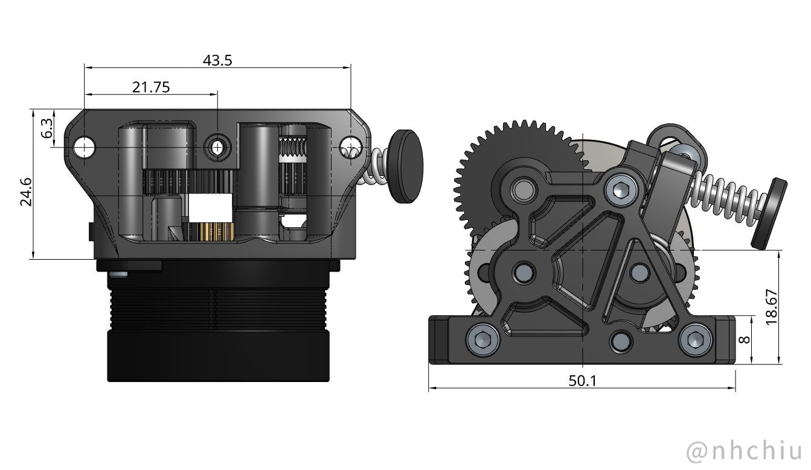
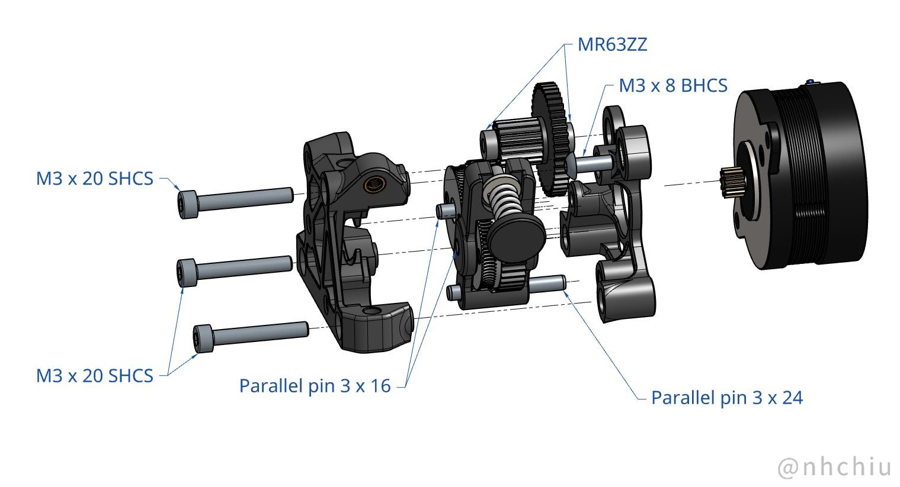
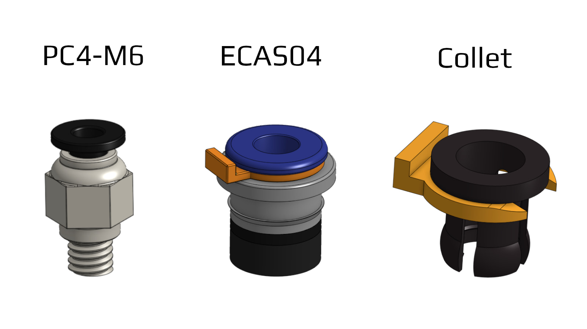

# ProtoXtruder



A extruder design that utilizes the large extrusion gears of [HGX-lite gear kit](https://www.aliexpress.com/item/1005004699143725.html)
and comes with the mounting pattern of the [Sherpa Mini Extruder](https://github.com/Annex-Engineering/Sherpa_Mini-Extruder).

There is also an **untested** version for [Bondtech LGX Lite](https://www.bondtech.se/product/lgx-lite-large-gears-extruder/) gears.

Refer to the following dimensions for compatibility with your printer.



[](https://github.com/nhchiu/VoronMods/blob/main/LICENSE)

> This page contains affiliate links. If you purchase products through these links, I may earn a small commission at no additional cost to you.
> This helps support the development and maintenance of my projects. Thank you for your support!

## BOM

- HGX Lite extruder gear kit ([AliExpress affiliate link](https://s.click.aliexpress.com/e/_DCabyeT))
  - MR63ZZ bearings x 2
  - 3mm shaft (16mm length) x 2
  - 3mm shaft (24mm length) x 1
  - Large extrusion gear with pin bearing x 2
  - Reduction gear x 1
  - Fasteners (included in the gear kit):
    - M3x8mm BHCS x 1
    - M3x20mm SHCS x 3
    - Heat set inserts (M3 x D4.5 x H5) x 3
- NEMA14 36mm round pancake motor with 8T or 10T gear (Affiliate links: [Moons](https://s.click.aliexpress.com/e/_DlgBbDN) or [LDO](https://s.click.aliexpress.com/e/_Dm8FCDD))

## Print Settings

3 perimeters, 40% infill. ABS recommended.

All STLs are oriented in the printing orientation. No support required.

It will need some bridging.

## Assembly



\* Remove the bottom half of the ECAS04 before inserting. (the black parts in plastic/rubber)

https://user-images.githubusercontent.com/14959712/228478235-7f9f1ea8-db8a-41ff-84bd-ff1c1cee3275.mp4

## Firmware Settings

For [klipper firmware](https://www.klipper3d.org/):

```ini
[extruder]
rotation_distance: 53.494165  # Re-calibrate your own value
gear_ratio: 44:10, 37:17
```

**You have to invert the `dir_pin` of the extruder if you were using a BMG gear kit.**

## Photo


## Changelog

### 2024-12-12

Bugfix update.

- Thicker idler arm to prevent it being bent over time. Hopefully fixes [#20](https://github.com/nhchiu/VoronMods/issues/20).
- The update at 2024-08-01 might cause the idler arm being bottomed out by tension and
  still not providing enough pressure on the filament. Slightly shortened the distance between the
  dual drive gears to address this issue.

### 2024-10-21

- Updated the collet cutout for better tube retaining and filament loading.
  No changes were made to other variants.
  Thanks to @MartijnGevaert for the suggestion.

### 2024-08-01

- Made better measurements of the HGX gears and slightly tweaked some dimensions accordingly.
- Some overall cleanups and aesthetic adjustments. Now the printed parts use roughly 10% less plastic.

### 2023-07-02

- Increase the maximum compression on the filament for better gripping.
- Fix the hole size of the idler shaft so it doesn't slip out during print.
- Variants for 3 types of Bowden tube retainers.

  
- Replaced the M3 x 16 screw to M3 x 20 to make space for the Bowden tube retainers.

### 2023-03-29

- Initial release

## Credits

- [Sherpa Mini Extruder](https://github.com/Annex-Engineering/Sherpa_Mini-Extruder) by [Annex Engineering](https://github.com/Annex-Engineering)
