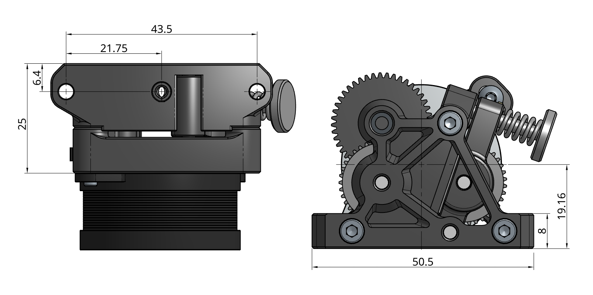
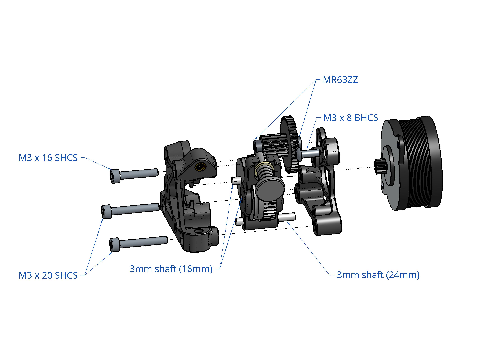
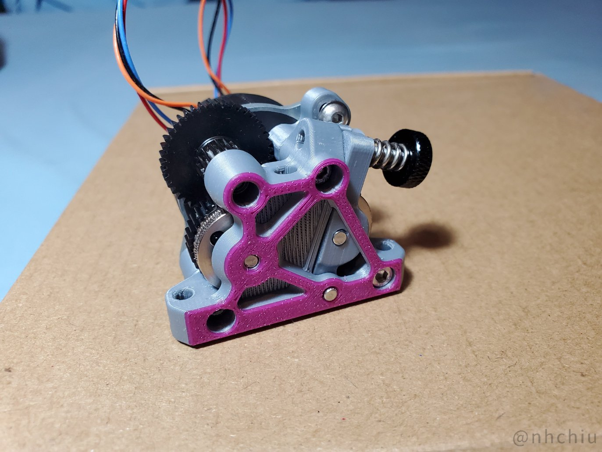
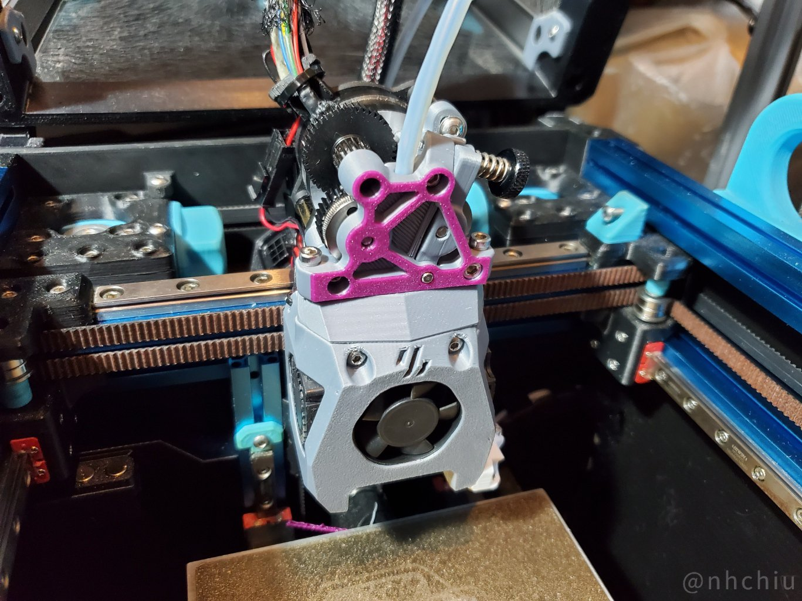

# ProtoXtruder


A extruder design that utilizes the large extrusion gears of [HGX-lite gear kit](https://www.aliexpress.com/item/1005004699143725.html)
and comes with the mounting pattern of the [Sherpa Mini Extruder](https://github.com/Annex-Engineering/Sherpa_Mini-Extruder).

There is also an **untested** version for [Bondtech LGX Lite](https://www.bondtech.se/product/lgx-lite-large-gears-extruder/) gears.

Refer to the following dimensions for compatibility with your printer.



[](https://github.com/nhchiu/VoronMods/blob/main/LICENSE)

## BOM

- HGX Lite extruder gear kit ([https://www.aliexpress.com/item/1005004699143725.html](https://www.aliexpress.com/item/1005004699143725.html))
  - MR63ZZ bearings x 2
  - 3mm shaft (16mm length) x 2
  - 3mm shaft (24mm length) x 1
  - Large extrusion gear with pin bearing x 2
  - Reduction gear x 1
  - Fasteners (included in the gear kit):
    - M3x8mm BHCS x 1
    - M3x16mm SHCS x 1
    - M3x20mm SHCS x 2
    - Heat set inserts (M3 x D4.5 x H5) x 3
- NEMA14 36mm round pancake motor with 10T gear

## Print Settings

3 perimeters, 40% infill. ABS recommended.

All STLs are oriented in the printing orientation. No support required.

It will need some bridging.

## Assembly



https://user-images.githubusercontent.com/14959712/228478235-7f9f1ea8-db8a-41ff-84bd-ff1c1cee3275.mp4

## Firmware Settings

For [klipper firmware](https://www.klipper3d.org/):

```ini
[extruder]
rotation_distance: 53.494165  # Re-calibrate your own value
gear_ratio: 44:10, 37:17
```

**You have to invert the `dir_pin` of the extruder if you were using a BMG gear kit.**

## Photo





## Changelog

### 2023-03-29

- Initial release

## Credits

- [Sherpa Mini Extruder](https://github.com/Annex-Engineering/Sherpa_Mini-Extruder) by [Annex Engineering](https://github.com/Annex-Engineering)
