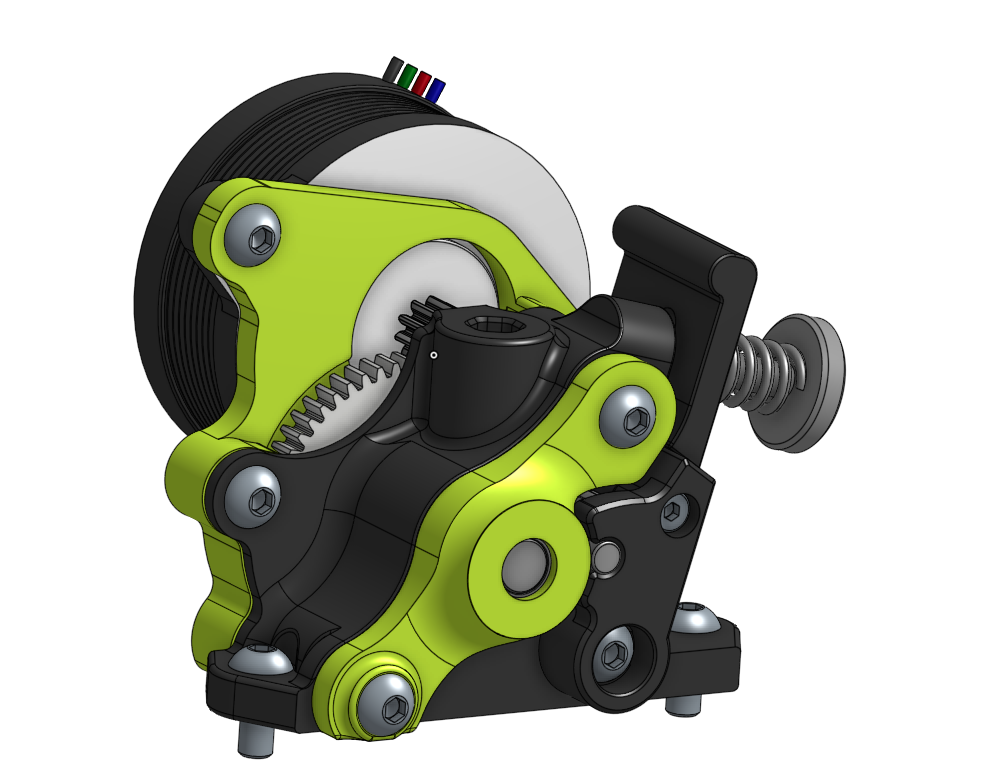
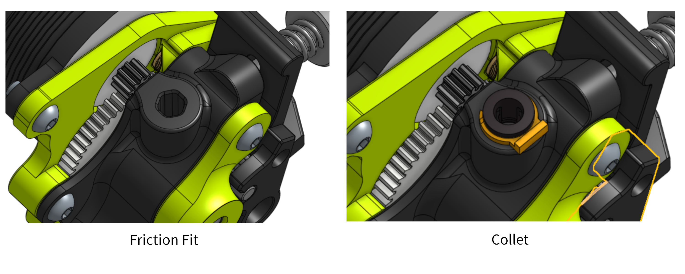
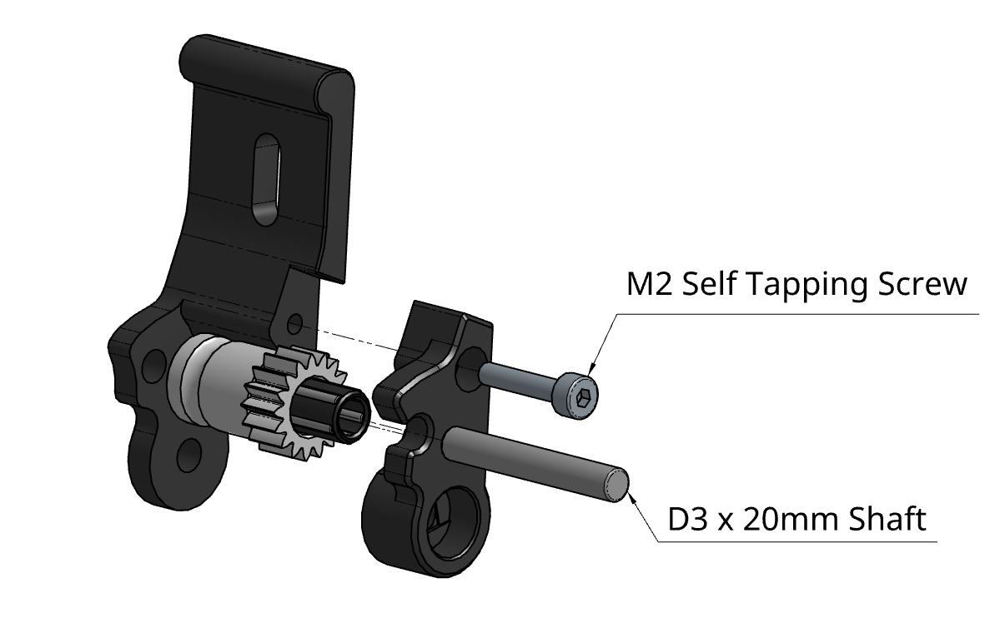
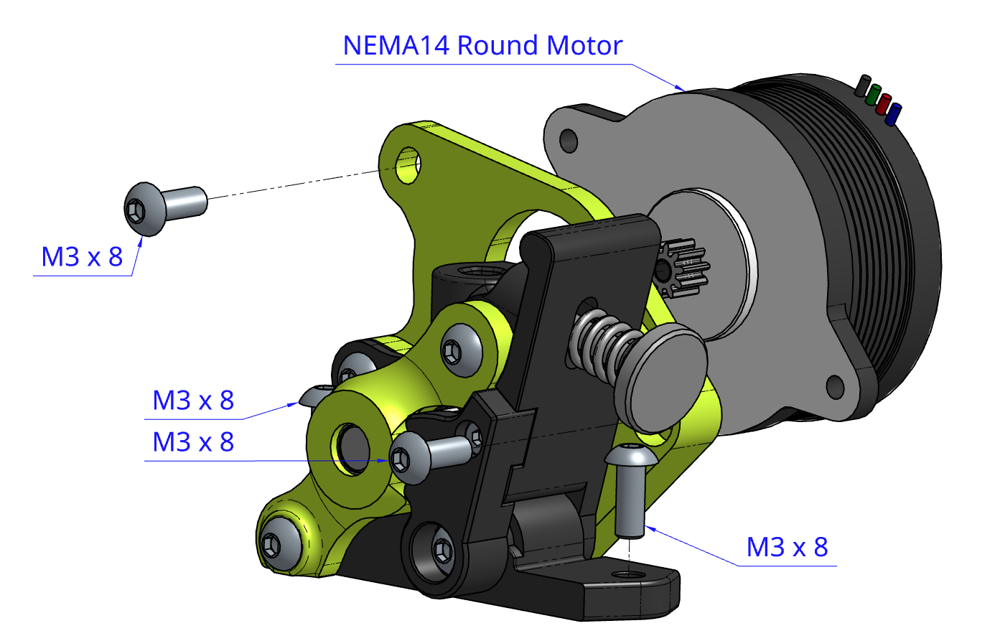

# Vorxtrudort (HextrudORT for Voron)

Design is based on the compact and lightweight [HextrudORT](https://miragec79.github.io/HextrudORT/).

HextrudORT is designed to be integrated with the X carriage and the hotend to make a compact toolhead, which is not directly compatable with modular toolhead design.

The major changes of Vorxtrudort are:

1. Stand-alone extruder with different mounting options.
2. Reduce printing support material.
3. Use heatset inserts instead of hex nuts.

I don't have a scale. If anyone would like to do a weight comparison with other extruder, please share it on Voron Discord.

## BOM

- Bondtech BMG internals
- NEMA14 36mm round pancake motor with 10T gear
- A short peice of PTFE tube (4mm OD, 2mm ID)
- M3 Heatset insearts (M3xD5xH4) x 4
- M3 BHCS or SHCS:
  - 8mm x 5
  - 16mm x 1
  - 20mm x 1
  - 25mm x 1
- M2 x 10mm Self Tapping Screw x 1

## Print Settings

Same as Voron spec. 4 perimeters, 40% infill.

No support. There are built-in support in the STL.

## File Naming

There are several variations. For the coresponding files they are named as follows:

`Part_Name_[Mounting_Pattern]_[PTFE_Inlet]`

Available mounting pattern: `SherpaMini` or `OrbiterV2`

PTFE inlet: `FrictionFit` or `Collet`

## Assembly

## Photo

## Changelog

### 2022-07-09

- Initial release

## Credits and Related Projects

- [HextrudORT](https://miragec79.github.io/HextrudORT/) by [MirageC79](https://github.com/MirageC79)
- [Sherpa Mini Extruder](https://github.com/Annex-Engineering/Sherpa_Mini-Extruder) by [Annex Engineering](https://github.com/Annex-Engineering)
- [Orbiter Projects](https://orbiterprojects.com/) by Róbert Lőrincz
