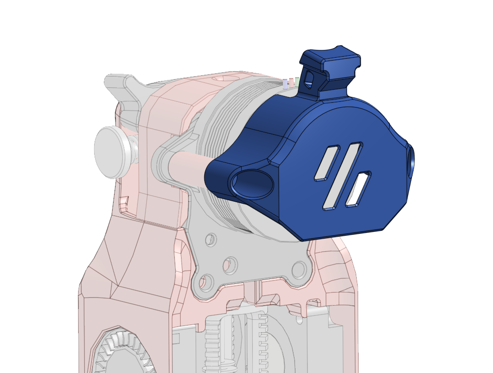
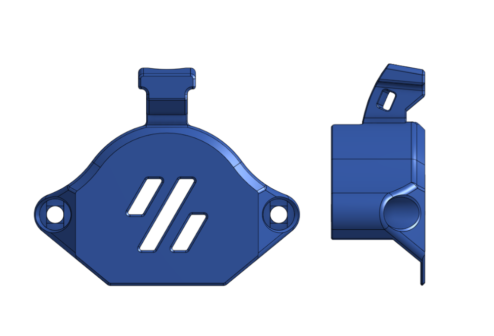
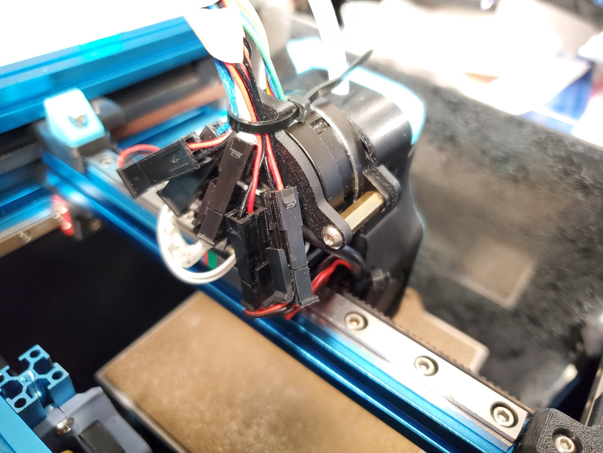
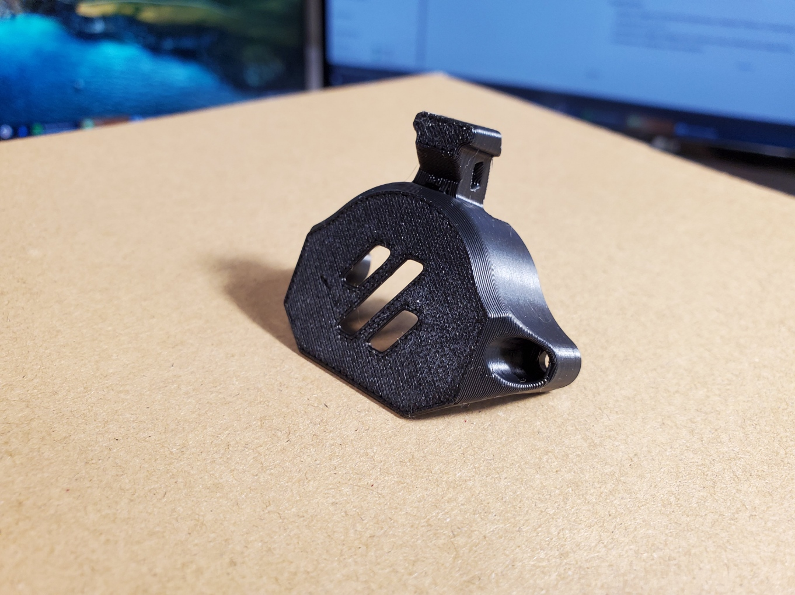
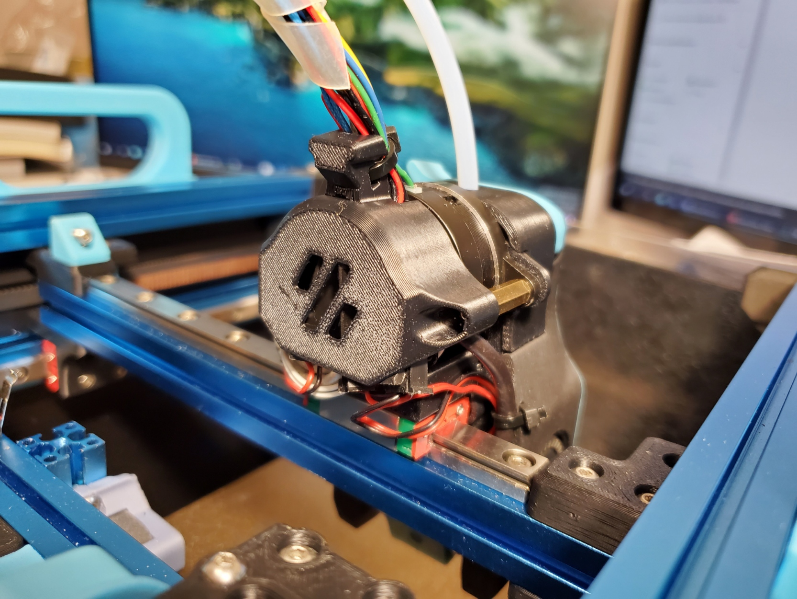
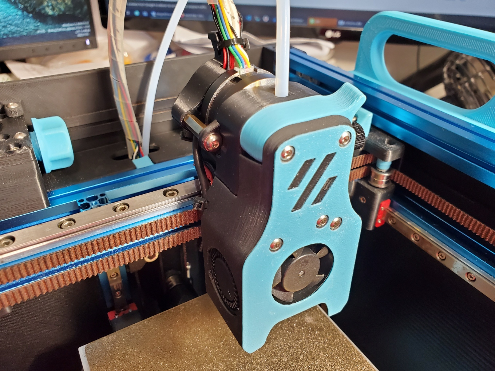

# Connector Cover for Voron 0.1

I could not get the wires tidy for the mini-AB. So I made a cover like the AfterBurner does.

Print with the Voron standard settings. No support required.

It should be a drop-in replacement for the [Strain_Relief_Body_x1.STL](https://github.com/VoronDesign/Voron-0/blob/Voron0.1/STLs/Toolheads/Mini_Afterburner/Strain_Relief_Body_x1.STL).

## Photos

## Changelog

### 2022-02-04

- Initial release
