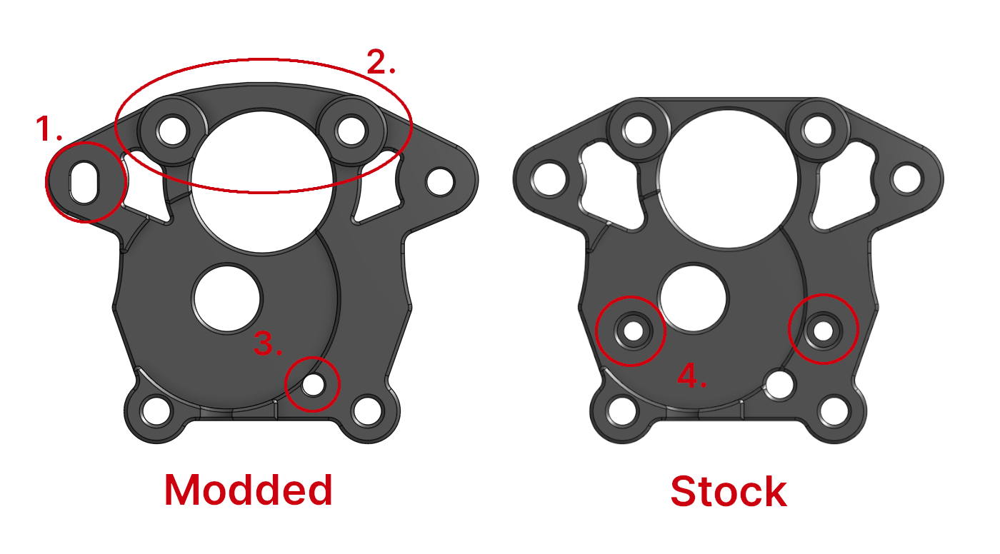
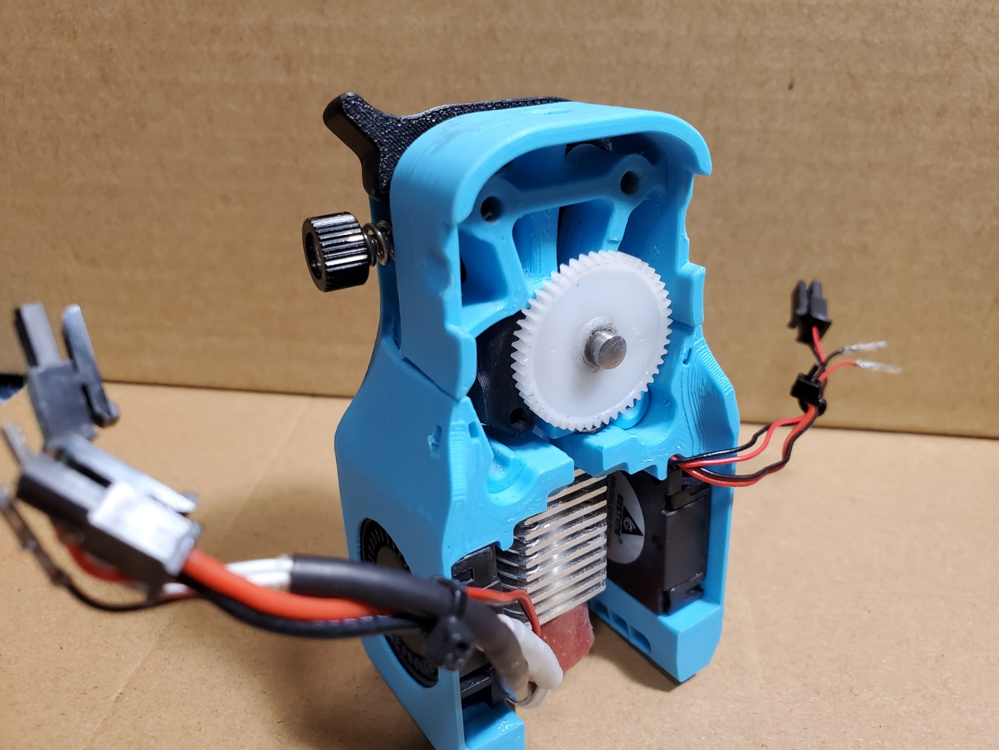
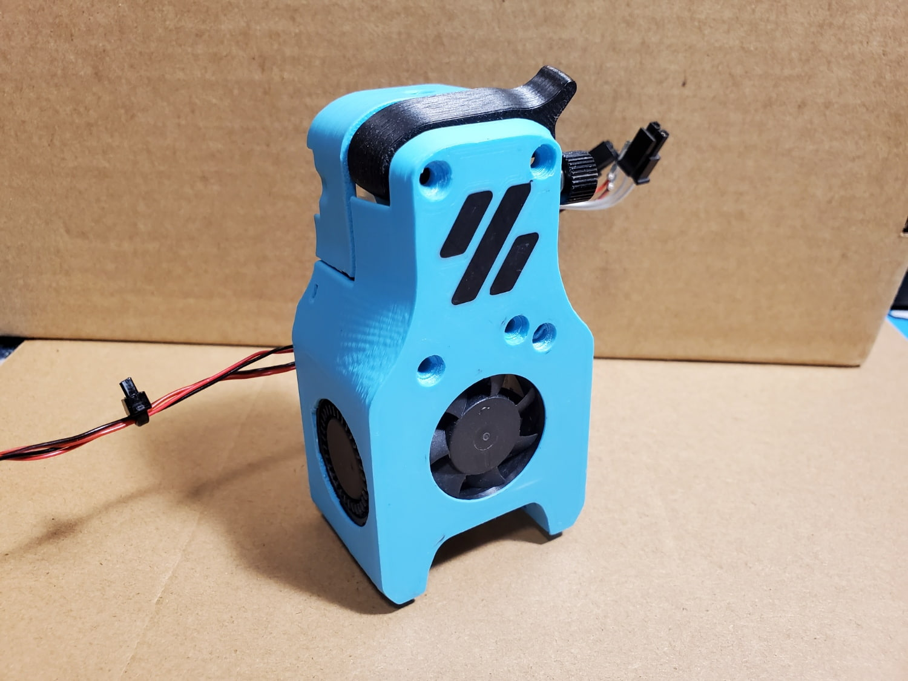
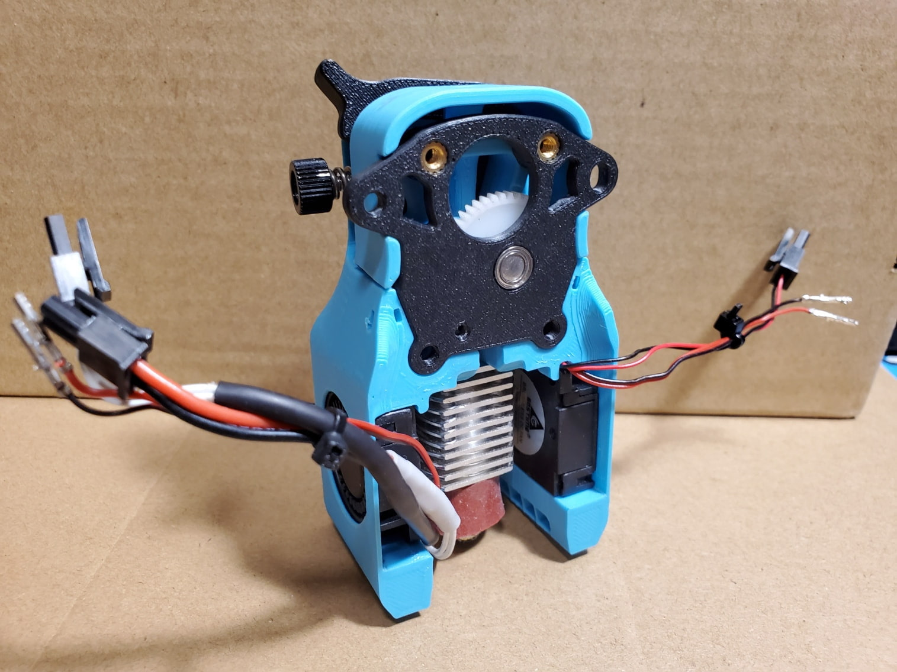
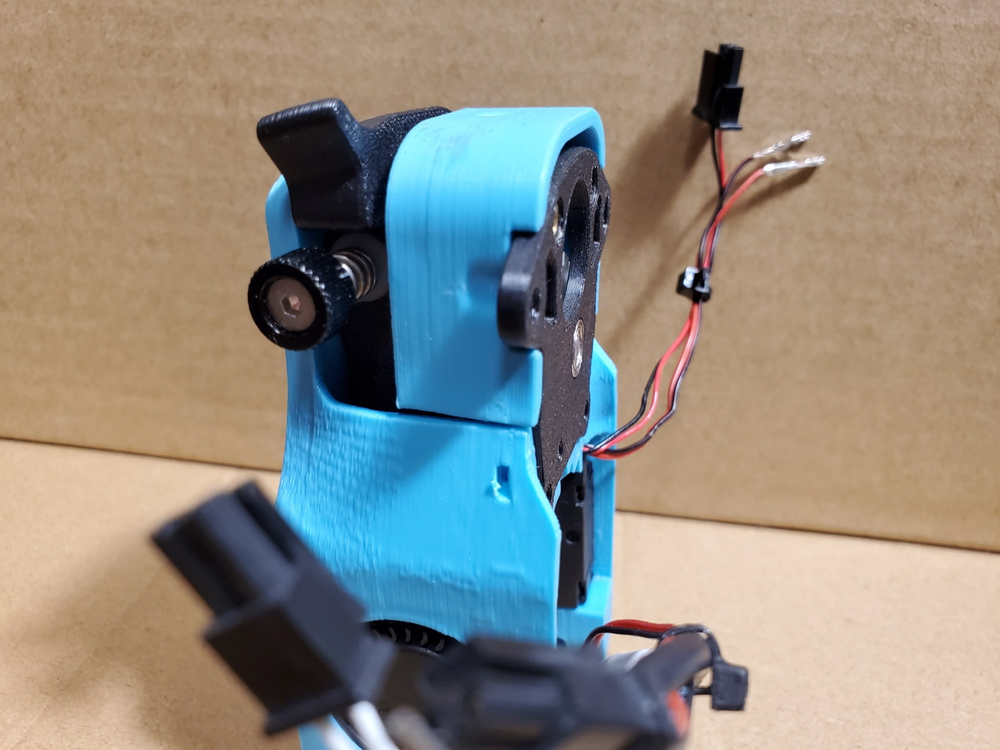
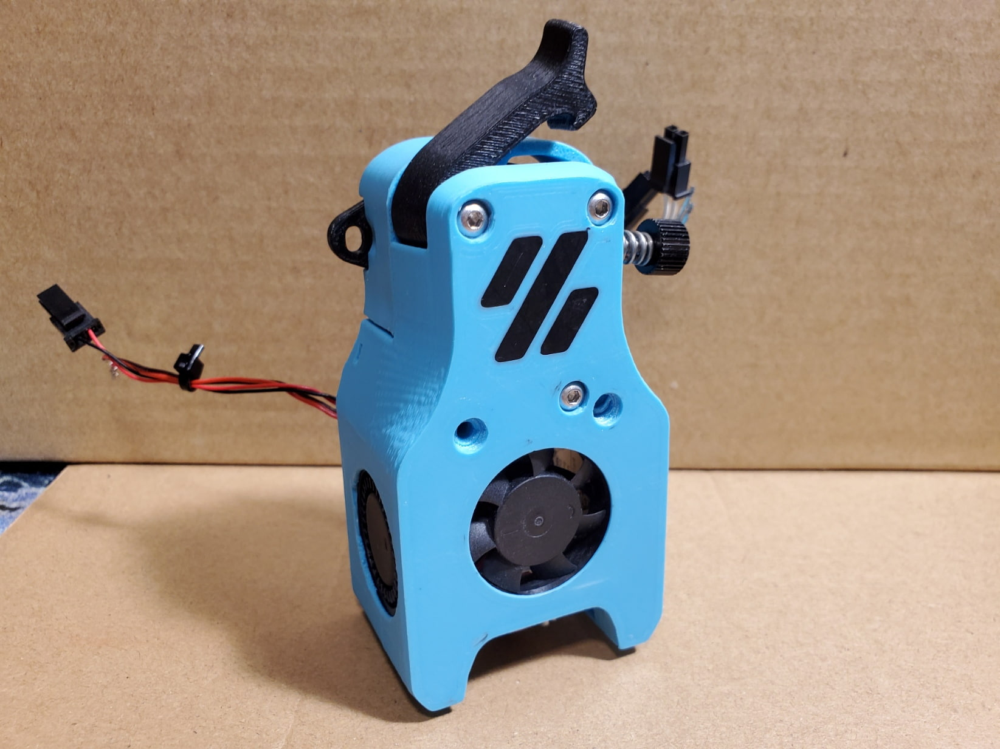
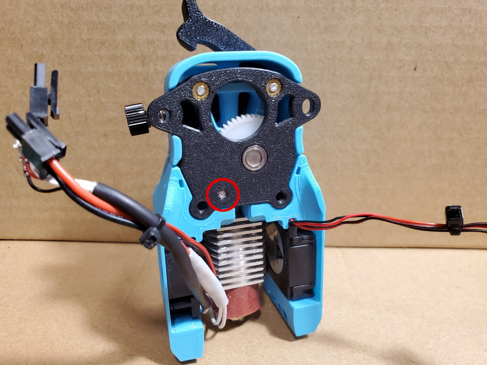
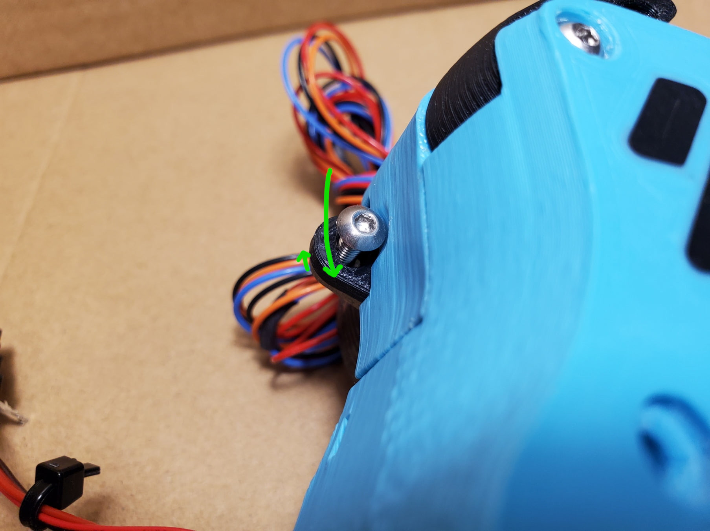
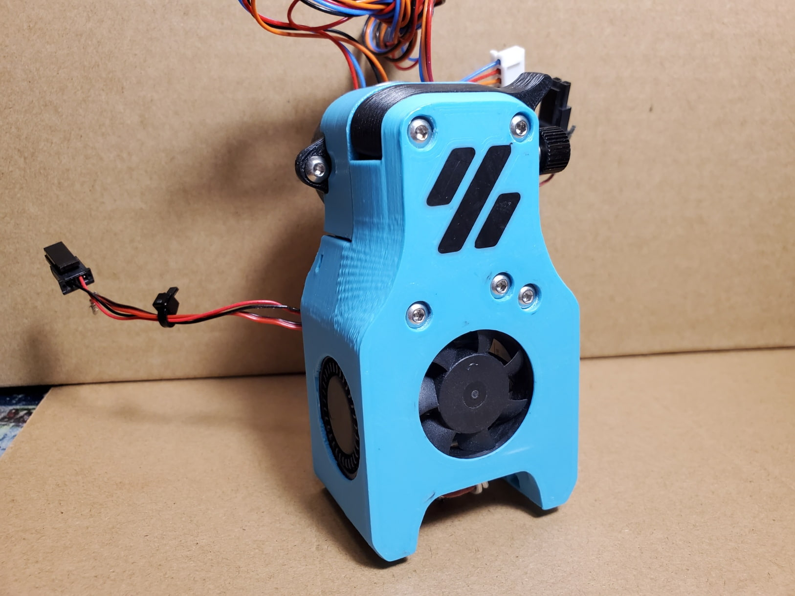
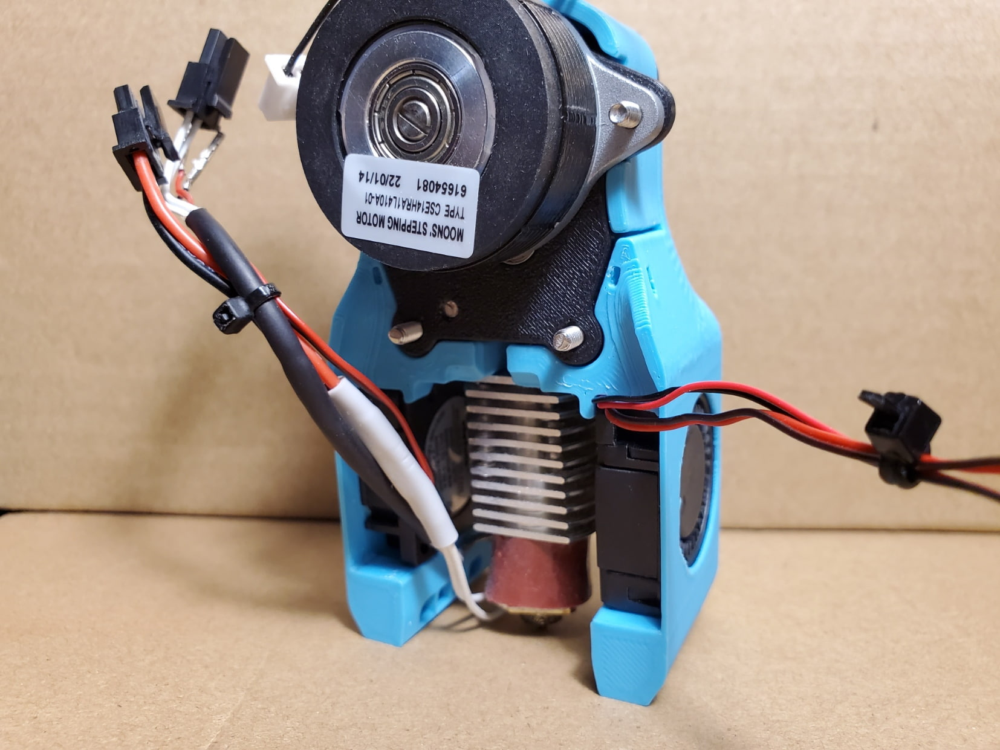

# Motor Frame Mod for Mini Afterburner

Motor frame mod ([link to the original file](https://github.com/VoronDesign/Voron-0/blob/Voron0.1/STLs/Toolheads/Mini_Afterburner/Motor_Frame_x1.stl)) for mini-afterburner.
This is my attempt to solve the wood grain / issue-6 print quality problem, and also make it less prone to some other issues.

The following changes are made:

1. Slotted screw hole on one side so the motor can be slightly moved to adjust for better gear meshing.
2. Strengthen the top of the part so the frame doesn't get bent easily if the top two screws are over-tightened.
3. Shrinked this hole for the screw to thread into platic (Refer to the assembly instruction for more info).
4. Removed the two holes for M2 self-tapping screws.

## BOM

The printed part, and replace one M3x35 (for the guidler) with M3x30.

## Assembly Instruction

I tried slightly changing the way mini-AB is assemled.
Hope it is easier and doesn't run into issues.

1. Put the BMG gears and mid body together without the M3 screws.

   
   

2. Put the MR85 bearing and the motor frame on.

   Make sure the shaft doesn't protude the back of the moter frame.

   
   

3. Fasten three M3x30 screws.

   Note the one going through the guidler screws directly into plastic and doesn't extend beyond the motor frame.

   **They should be just slightly tight enough that hold the parts together. No extra torque!**

   
   

4. Mount the motor. First fasten the right side and leave the left screw a bit loose.

   There should be some space for the motor to move up and down.

   The gears are blocked inside so you cannot test the gear meshing like assembling Clockwork.

   First pull the motor all the way down so the gears should be tight against each other, and then back up just the tiniest bit you can move.

   

5. Finally, put two M3x35 screws on and mount to the X carriage.

   
   

## Changelog

### 2022-07-04

- Initial release

## Credit

@Nemgrea and the Voron Design crews for the mini-AB design.

If you tried this, feedbacks are welcome through Voron Discord, @nhchiu#0363.
