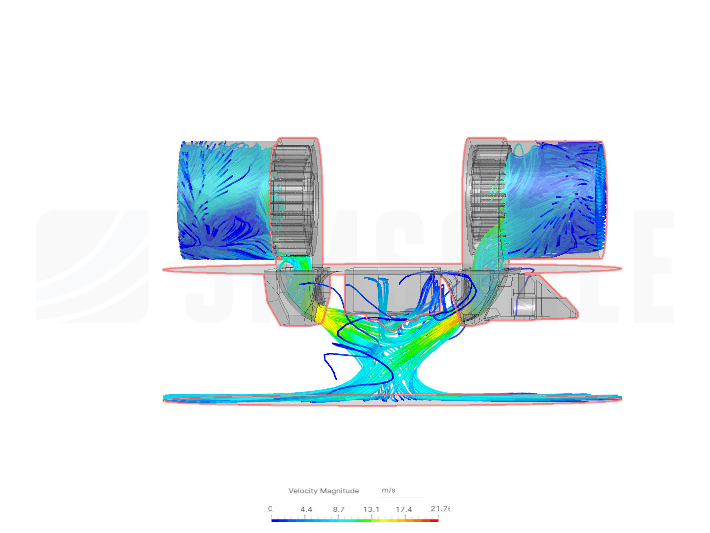
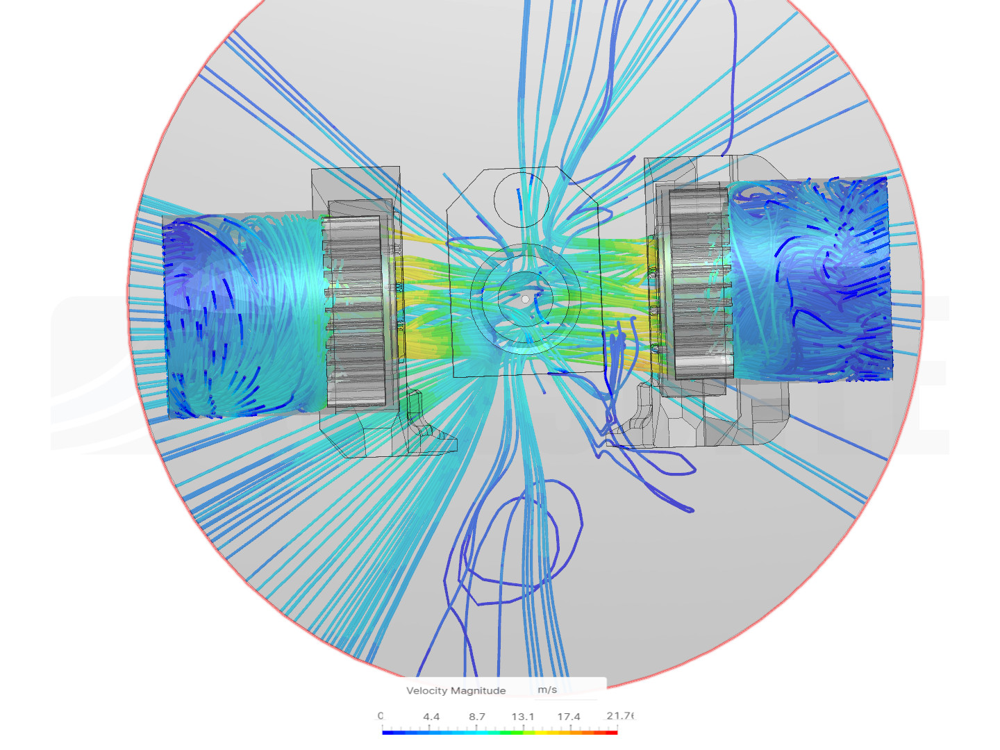
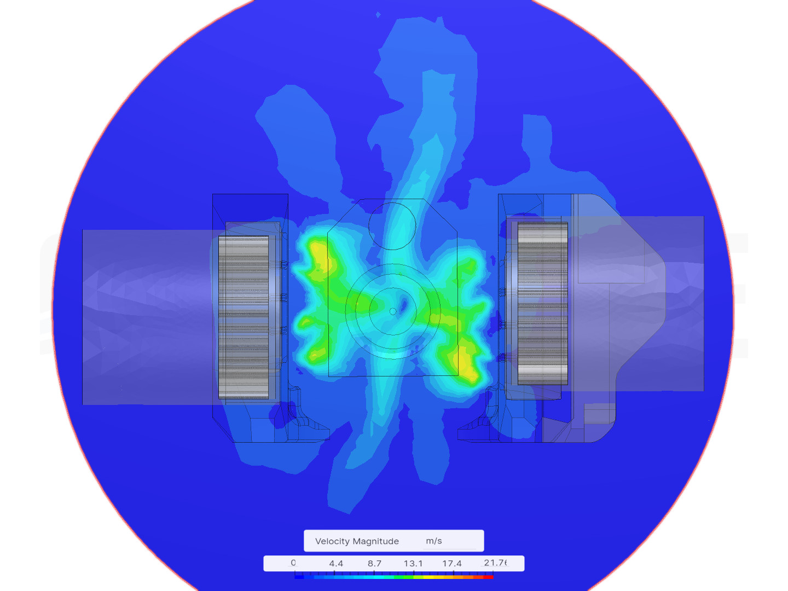

# Mini Stealthdort

Yet another versatile toolhead design for Voron-0.

## Features

- Shorter distance between the extruder and the hotend.
- Light-weight printed parts.
- The extruder will be mounted 4mm lower, so the tube is less likely to rub on the top-hat.
- Built in cut-out for [Klicky probe for V0](https://github.com/jlas1/Klicky-Probe/tree/main/Printers/Voron/v0) and [ZeroClick](https://github.com/zruncho3d/ZeroClick) (use the provided probe STL in this repo).
- Redesigned part cooling fan duct, which I don't know is better or worse (See the [CFD simulation](#cfd-simulation) below).
- Similar mounting style as [Mini AfterSherpa](https://github.com/PrintersForAnts/Mini-AfterSherpa)
  The mounting holes and dimensions are mostly compatible with Mini AfterSherpa but the top surface is 4mm lower

  

## CFD Simulation

Tried some rough CFD simulation in [Simscale](https://www.simscale.com/).

Particle traces around the nozzle:

Air velocity magnitude on a horizontal plane 0.5mm below the tip of the nozzle:

## BOM

- Heatset insert x 2 (for the extruder mount)
- **M3x20mm** x 2 (for mounting to the carriage)
- 3010 blower fans for part cooling
- 3007 or 3010 axial fan for hotend cooling (depending on the hotend)

Optional:

- One heatset insert for klicky probe mount
- M2 self-tapping screw for ZeroClick

## Supported Options

Extruder:

- [Sherpa Mini](https://github.com/Annex-Engineering/Sherpa_Mini-Extruder)
- ~~[Sailfin](https://github.com/CroXY3D/Sailfin-Extruder) and [Sharkfin](https://github.com/KayosMaker/Sailfin-Extruder/tree/main/Usermods/KayosMaker/Sharkfin) (with Sherpa mount variant)~~
  May require a spacer if using the stock X carriage. WIP.
- [Vorxtrudort](https://github.com/nhchiu/VoronMods/tree/main/Extruder)

Hotend:

| Hotend                         | Supported Hotend Fan | Notes                                                                                                                                       |
| ------------------------------ | -------------------- | ------------------------------------------------------------------------------------------------------------------------------------------- |
| Phaetus Dragon & Dragonfly BMO | 3007                 | Refer to [this image](https://github.com/PrintersForAnts/Mini-AfterSherpa/blob/main/images/hotend-mounting-holes.png) for mounting position |
| Slice Engineering Mosquito     | 3010 & 3007          |                                                                                                                                             |
| E3D Revo Voron                 | 3010 & 3007          | Not tested                                                                                                                                  |

## Photo

## Changelog

### 2022-07-30

- Revised the fan duct
- Moved the zip tie slot higher so it clears the X carriage
- Tweaked some faces and removed most of the fillets

### 2022-07-16

- Added E3D Revo Voron support (not tested yet)

### 2022-07-10

- Initial release

## Credits and Related Projects

- [Voron-0 and Mini AfterBurner](https://github.com/VoronDesign/Voron-0) by VoronDesign
- [Mini AfterSherpa](https://github.com/PrintersForAnts/Mini-AfterSherpa)
- [Mini After-LGX-Lite](https://github.com/VoronDesign/VoronUsers/tree/master/printer_mods/Bondtech/Mini-After-LGX-Lite)
- [MiniAfterHybrid](https://github.com/camerony/VoronCustom/tree/main/v0.1_MiniAfterHybrid)
- [Apogee Tool Head](https://orbiterprojects.com/ender-3-v2/)
- [Sherpa Mini Extruder](https://github.com/Annex-Engineering/Sherpa_Mini-Extruder)
- [Sailfin Extruder](https://github.com/CroXY3D/Sailfin-Extruder)
- [Sharkfin Extruder](https://github.com/KayosMaker/Sailfin-Extruder/tree/main/Usermods/KayosMaker/Sharkfin)
- [Klicky Probe](https://github.com/jlas1/Klicky-Probe)
- [ZeroClick](https://github.com/zruncho3d/ZeroClick)
