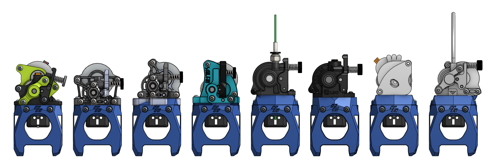
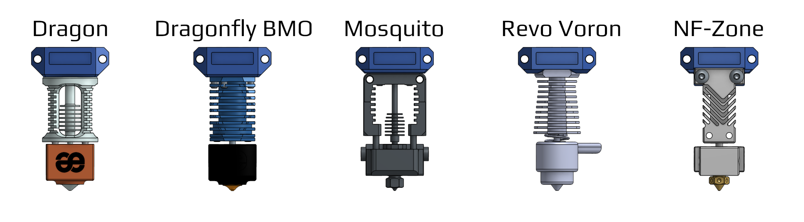
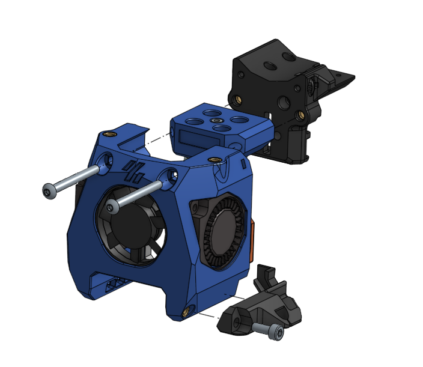
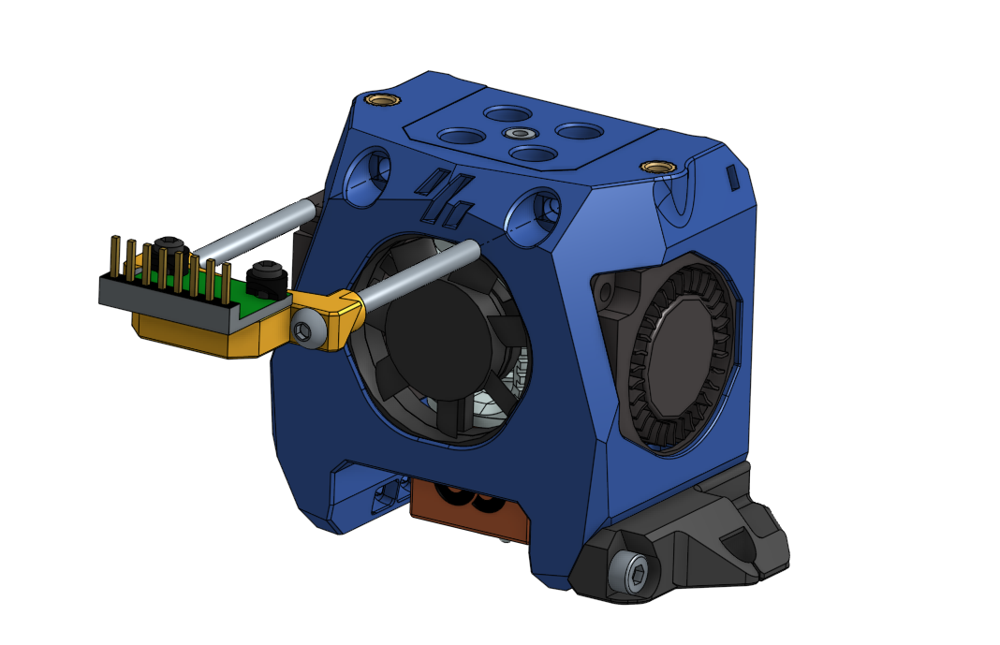

# Mini Stealthdort

Yet another versatile toolhead design for Voron-0.

## Features

- Shorter distance between the extruder and the hotend.
- Light-weight printed parts.
- The extruder will be mounted 4mm lower, so the tube is less likely to rub on the top-hat.
- Built in cut-out for [Klicky probe](https://github.com/jlas1/Klicky-Probe/tree/main/Printers/Voron/v0) and [ZeroClick](https://github.com/zruncho3d/ZeroClick) (use the provided probe STLs in this repo).
- Redesigned part cooling fan duct.
- Similar mounting style as [Mini AfterSherpa](https://github.com/PrintersForAnts/Mini-AfterSherpa)
  The mounting holes and dimensions are mostly compatible with Mini AfterSherpa but the top surface is 4mm lower

  

## BOM

- M3 Heatset insert x 2 (for the extruder mount)
- **M3x30mm** x 2 (for mounting to the carriage)
- 3010 blower fans for part cooling
- 3007 or 3010 axial fan for hotend cooling (depending on the hotend)

Optional:

- One M3 heatset insert for klicky probe mount
- M2x8mm screw for ZeroClick (Or use the M2 self-tapping screw with Voron BOM and trim down 2mm)
- M3x40mm x 2 (for mounting ADXL345)

## Supported Hardware

Choose the supported extruder and hotend listed bellow and print the corresponding STL files.

### Extruder

| Extruder                                                                                                                                                                                | Printed parts                                 |
| --------------------------------------------------------------------------------------------------------------------------------------------------------------------------------------- | --------------------------------------------- |
| [Vorxtrudort](https://github.com/nhchiu/VoronMods/tree/main/Extruder)                                                                                                                   | `Cowling.stl`                                 |
| [Sherpa Mini](https://github.com/Annex-Engineering/Sherpa_Mini-Extruder)                                                                                                                | `Cowling.stl`                                 |
| [Sherpa Micro](https://github.com/Annex-Engineering/Sherpa_Micro-Extruder)                                                                                                              | `Cowling.stl` and `Sherpa_micro_adapter.stl`  |
| [Sailfin](https://github.com/CroXY3D/Sailfin-Extruder) or [Sharkfin](https://github.com/KayosMaker/Sailfin-Extruder/tree/main/Usermods/KayosMaker/Sharkfin) (with Sherpa mount variant) | `Cowling.stl` and `Sailfin_spacer.stl`        |
| [Orbiter V1.5](https://orbiterprojects.com/orbiter-1-5)                                                                                                                                 | `Cowling.stl` and `Orbiter_V1.5_adapter.stl`  |
| [Orbiter V2.0](https://orbiterprojects.com/orbiter-v2-0/)                                                                                                                               | `Orbiter_V2_cowling.stl`                      |
| [LGX Lite](https://www.bondtech.se/product/lgx-lite-large-gears-extruder/)                                                                                                              | `Cowling.stl` and `LGX_Lite_adapter.stl`      |
| [Vz-Hextrudort](https://github.com/VzBoT3D/Vz-HextrudORT)                                                                                                                               | `Cowling.stl` and `Vz-Hextrudort_adapter.stl` |

### Hotend

| Hotend                     | Supported Hotend Fan | Printed Part              |
| -------------------------- | -------------------- | ------------------------- |
| Phaetus Dragon             | 3007                 | `Dragon-Mount.stl`        |
| Phaetus Dragonfly BMO      | 3007                 | `Dragonfly-BMO-Mount.stl` |
| Slice Engineering Mosquito | 3010 & 3007          | `Mosquito-Mount.stl`      |
| E3D Revo Voron             | 3010 & 3007          | `Revo-Voron-Mount.stl`    |
| Mellow NF-Zone             | 3010 & 3007          | `NF-Zone-Mount.stl`       |

## Assembly

## ADXL345 Mount

Print out `ADXL345_Mount.stl` and mount the ADXL345 module to it with 2 M2 self-tapping screws and 2 [printed washer (from Stealthburner)](https://github.com/VoronDesign/Voron-Stealthburner/blob/main/STLs/Stealthburner/ADXL345_Mounts/sb_adxl_washer_x2.stl).

Use 2 M3x40mm screws to mount it on the toolhead for calibrating input shaper.

## Photo

## Changelog

### 2023-01-09

- Added supported extruder: Sherpa Micro, Orbiter V2.0, LGX Lite, Vz-Hextrudort
- Added supported hotend: Mellow NF-Zone
- Modular design for hotend and extruder so switching hotend is much easier
- Tweaked the low-poly design
- Filled up the gap between the klicky probe mount and the heatset insert

### 2022-08-04

- Added untested support for Sailfin / Sharkfin extruder and Orbiter V1.5

### 2022-07-30

- Revised the fan duct
- Moved the zip tie slot higher so it clears the X carriage
- Tweaked some faces and removed most of the fillets

### 2022-07-16

- Added E3D Revo Voron support (not tested yet)

### 2022-07-10

- Initial release

## Credits and Related Projects

- [Voron-0 and Mini AfterBurner](https://github.com/VoronDesign/Voron-0) by VoronDesign
- [Mini AfterSherpa](https://github.com/PrintersForAnts/Mini-AfterSherpa)
- [Mini After-LGX-Lite](https://github.com/VoronDesign/VoronUsers/tree/master/printer_mods/Bondtech/Mini-After-LGX-Lite)
- [MiniAfterHybrid](https://github.com/camerony/VoronCustom/tree/main/v0.1_MiniAfterHybrid)
- [Apogee Tool Head](https://orbiterprojects.com/ender-3-v2/)
- [Sherpa Mini Extruder](https://github.com/Annex-Engineering/Sherpa_Mini-Extruder)
- [Sailfin Extruder](https://github.com/CroXY3D/Sailfin-Extruder)
- [Sharkfin Extruder](https://github.com/KayosMaker/Sailfin-Extruder/tree/main/Usermods/KayosMaker/Sharkfin)
- [Orbiter Projects](https://orbiterprojects.com)
- [Klicky Probe](https://github.com/jlas1/Klicky-Probe)
- [ZeroClick](https://github.com/zruncho3d/ZeroClick)
