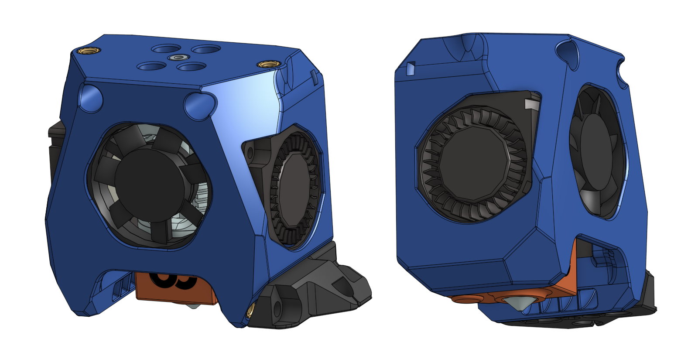
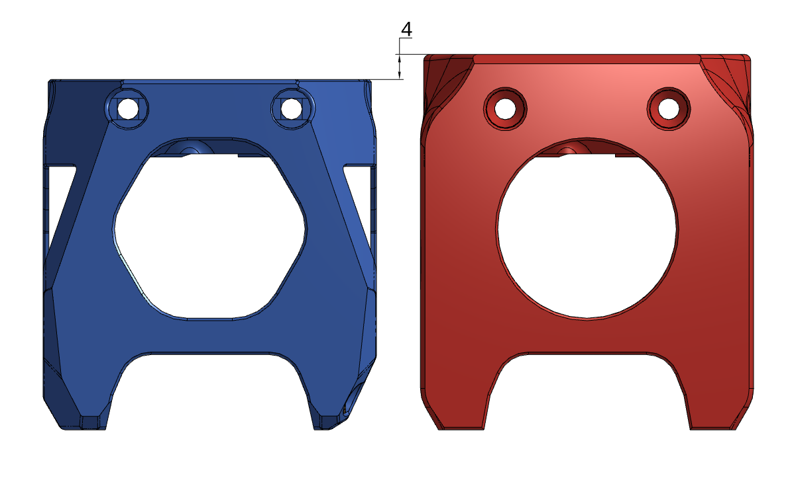
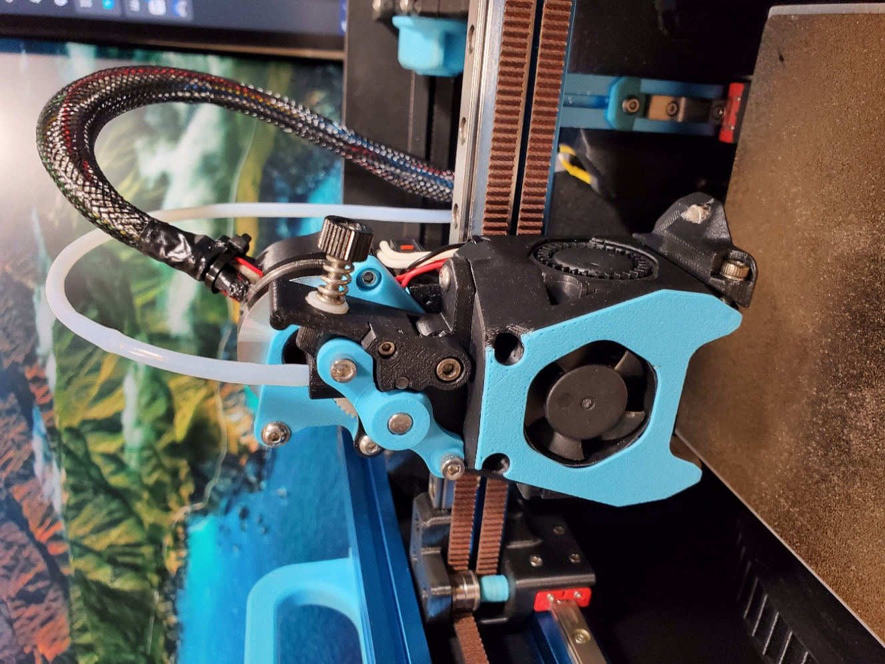

# V0 Toolhead

Yet another versatile toolhead design for Voron-0.

- Similar mounting style as [Mini AfterSherpa](https://github.com/PrintersForAnts/Mini-AfterSherpa)
- "Stealthy" look
- Built in cut-out for [klicky probe for V0](https://github.com/jlas1/Klicky-Probe/tree/main/Printers/Voron/v0) and [ZeroClick](https://github.com/zruncho3d/ZeroClick) (use the modded probe in this repo)
- Redesigned part cooling fan duct, which I don't know is better or worse.

The mounting holes and dimensions are mostly compatible with [Mini AfterSherpa](https://github.com/PrintersForAnts/Mini-AfterSherpa) but the top surface is 4mm lower

## BOM

- Heatset insert x 2 (for the extruder mount)
- **M3x20mm** x 2 (for mounting to the carriage)
- 3010 blower fans for part cooling
- 3007 or 3010 axial fan for hotend cooling (depending on the hotend)

Optional:

- One heatset insert for klicky probe mount
- M2 self-tapping screw for ZeroClick

## Supported Options

Extruder:

- [Sherpa Mini](https://github.com/Annex-Engineering/Sherpa_Mini-Extruder)
- [Sailfin](https://github.com/CroXY3D/Sailfin-Extruder) and [Sharkfin](https://github.com/KayosMaker/Sailfin-Extruder/tree/main/Usermods/KayosMaker/Sharkfin) (with Sherpa mount variant)
- [Vorxtrudort](https://github.com/nhchiu/VoronMods/tree/main/Extruder)

Hotend:

- Phaetus Dragon and Dragonfly BMO (refer to [this image of Mini-AfterSherpa](https://github.com/PrintersForAnts/Mini-AfterSherpa/blob/main/images/hotend-mounting-holes.png) for mounting position) - **Supports only 3007 axial fan**
- Slice Engineering Mosquito - **Fits Both 3010 and 3007 axial fan**

## Photo

## Changelog

### 2022-07-10

- Initial release

## Credits and Related Projects

- [Voron-0 and Mini AfterBurner](https://github.com/VoronDesign/Voron-0) by VoronDesign
- [Mini AfterSherpa](https://github.com/PrintersForAnts/Mini-AfterSherpa)
- [Mini After-LGX-Lite](https://github.com/VoronDesign/VoronUsers/tree/master/printer_mods/Bondtech/Mini-After-LGX-Lite)
- [MiniAfterHybrid](https://github.com/camerony/VoronCustom/tree/main/v0.1_MiniAfterHybrid)
- [Sherpa Mini Extruder](https://github.com/Annex-Engineering/Sherpa_Mini-Extruder)
- [Sailfin Extruder](https://github.com/CroXY3D/Sailfin-Extruder)
- [Sharkfin Extruder](https://github.com/KayosMaker/Sailfin-Extruder/tree/main/Usermods/KayosMaker/Sharkfin)
- [Klicky Probe](https://github.com/jlas1/Klicky-Probe)
- [ZeroClick](https://github.com/zruncho3d/ZeroClick)
