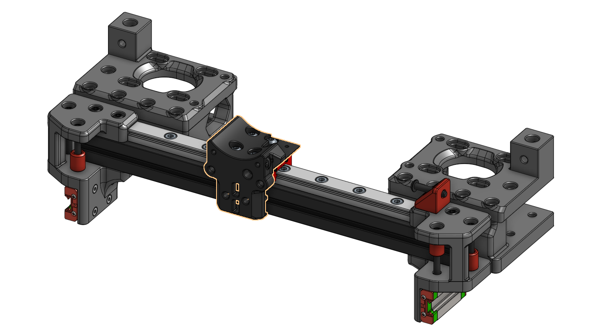
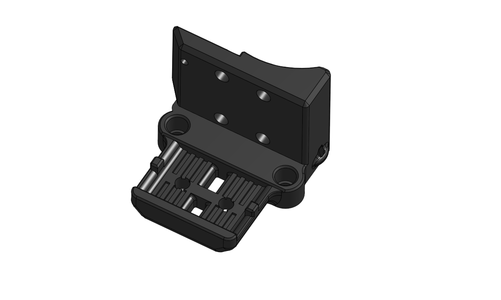
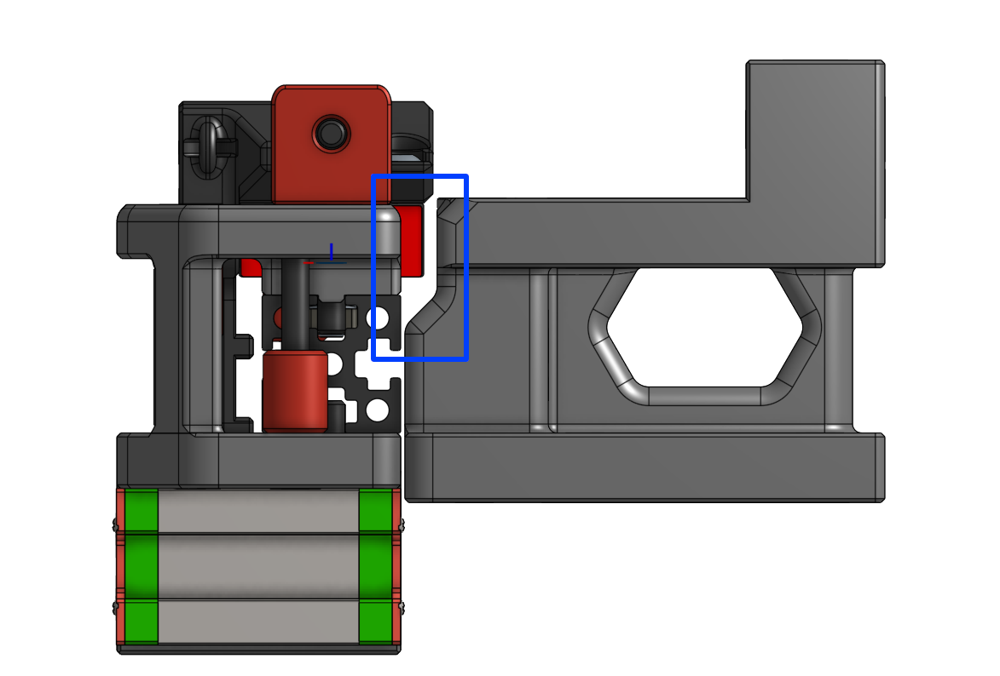
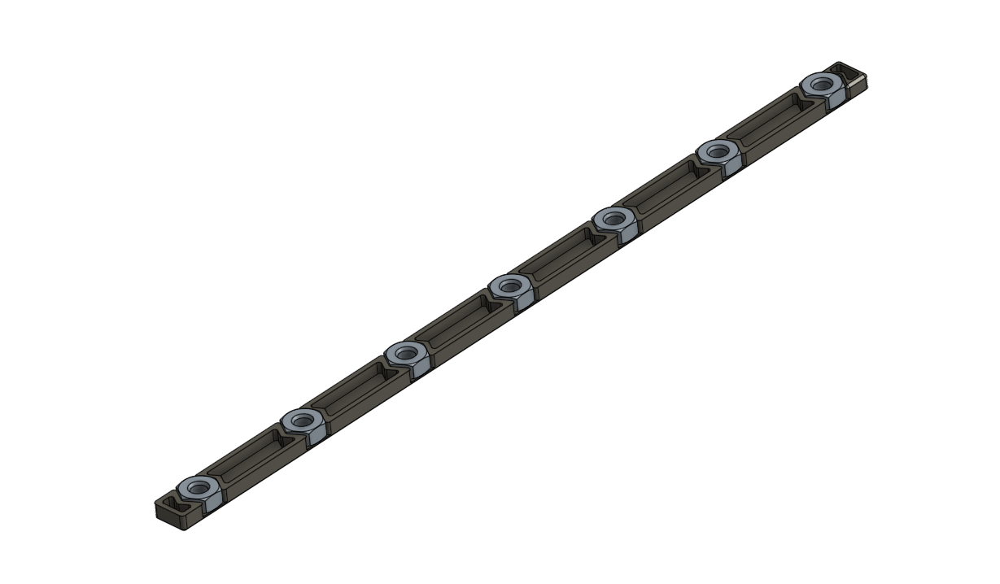

# X Axis MGN9C Mod

## BOM

### Fasteners

- 7 x M3x8 SHCS
- 7 x M3 Hex Nut
- 4 x M3x6 BHCS

### Motion

- 1 x MGN9 Rail - 150mm
- 1 x MGN9C Carriage

### Printed Parts

All the parts in the STLs folder is oriented and named with the Voron convension.

Print with the official suggested settings (4 perimeters, 0.4mm line width, 40% infill).

## Components

1. X Carriage

   

   It is made compatible with openbuild M3 T-nuts (10mm width) to hold the belts.

2. A/B Motor Mounts

   

   Added some clearance so no colision at Y max.

3. M3 Nut Spacers (optional)

   

   Keep the M3 hex nuts align with the MGN9 rail.

   Slide into the extrusion slot with the nuts facing **upwards**.

   (It might be too thick for MakerBeam extrusions.)

<!--

## Instructions

## Photos-->

## Changelog

### 2022-01-17

- Initial release
