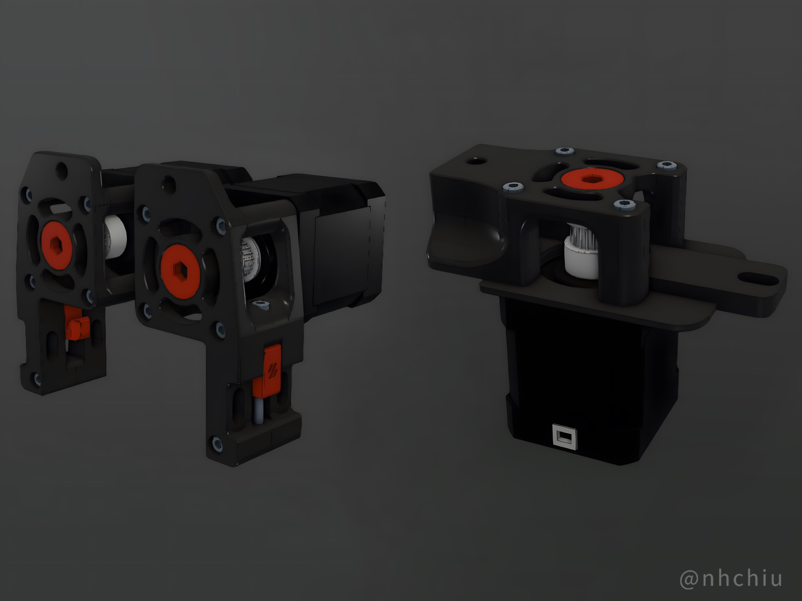
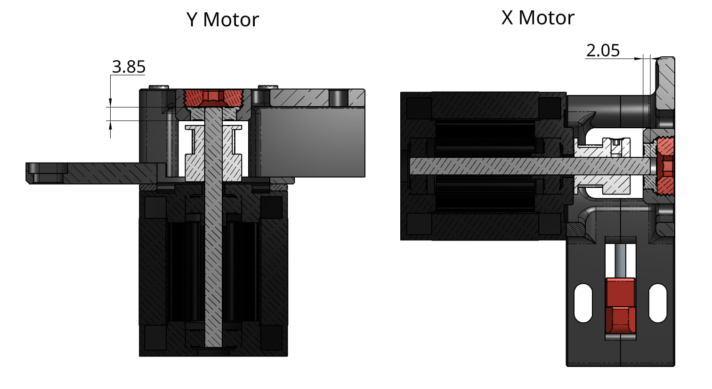
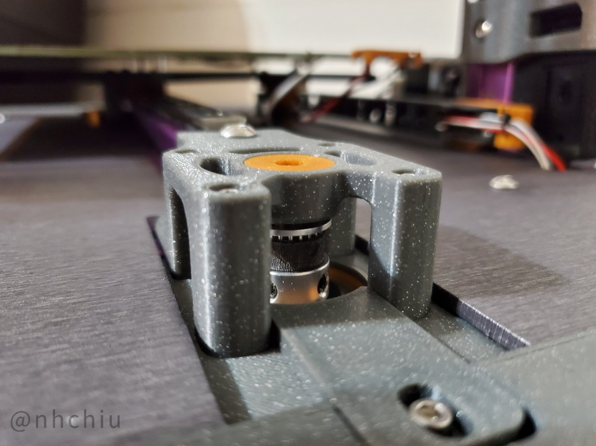
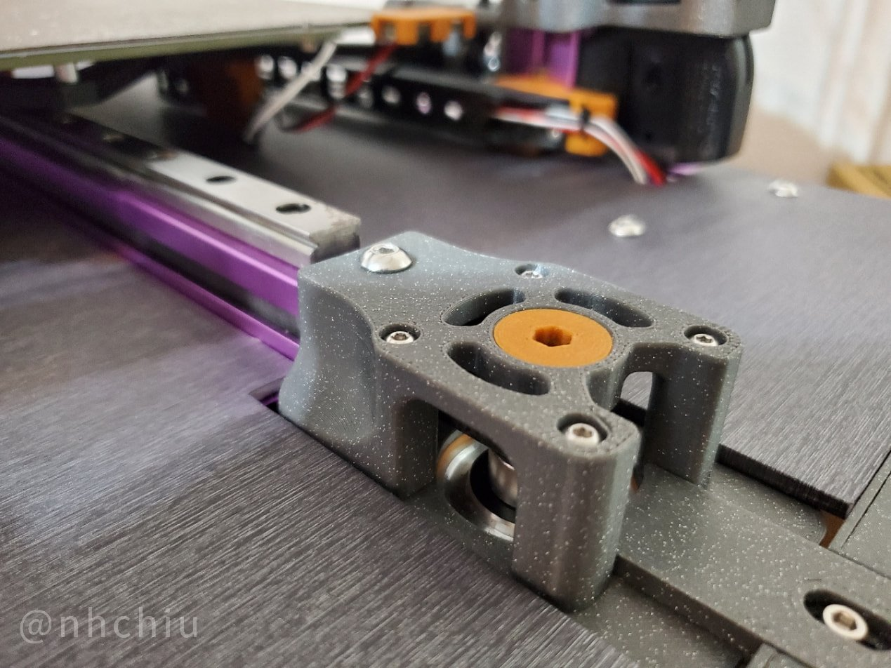
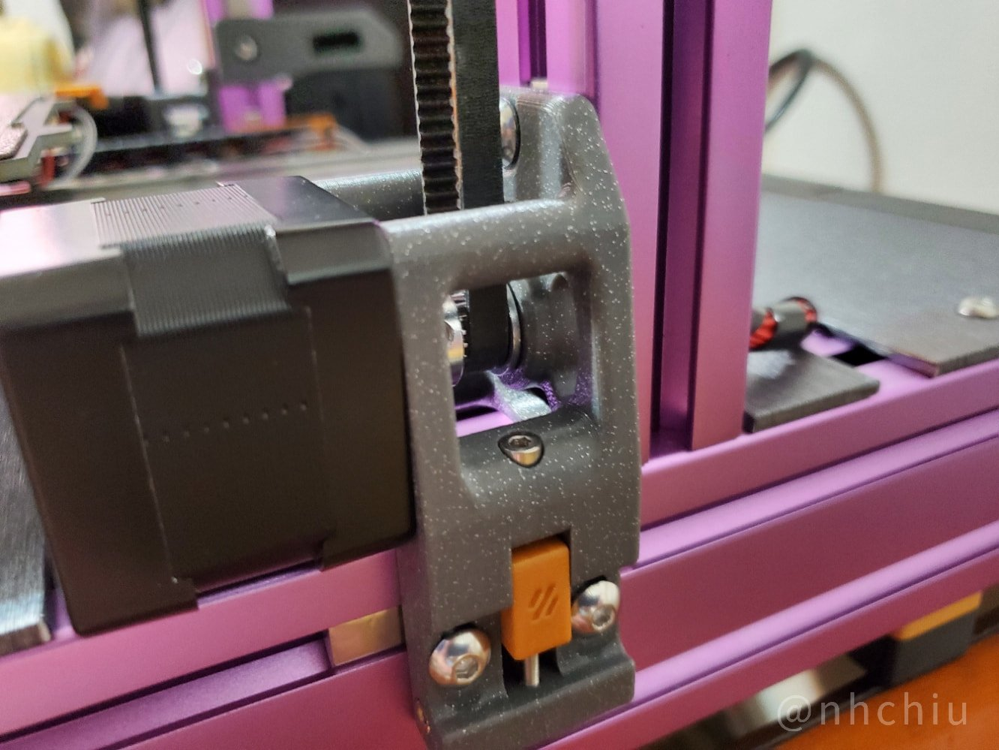
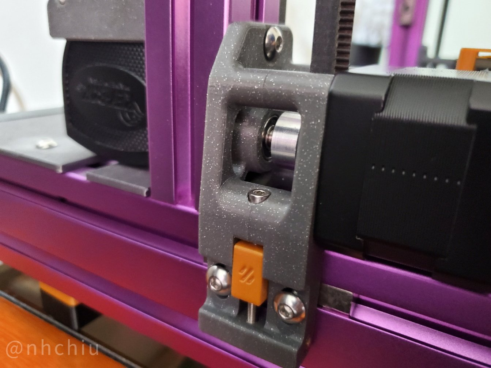

# Voron Switchwire Double Shear Motor Mount

This mod adds another bearing on the motor mount to support the other end of the motor shaft.
It reduces the bending effect on the shaft caused by the tension of the timing belt.
In theory it can make the motor runs smoother under high belt tension and most likely increase its lifespan too.

**All dimensions are designed to fit the stock Switchwire motors (24mm long shaft). If your motor has longer or shorter shaft, please check if it fits before proceeding.**
With the stock motor shaft length, the shaft can't reach through the full height of the bearing on X/Z motor mounts. But it should more or less still be helpful to hold the floating end of the shaft.

If you like my design, please consider supporting my work through the following platforms. Thank you!

## Features

- Double shear mount.
- Added indexing features between mating parts.
- Some tweaks on the XZ motor mounts ported from [SW More Robust XZ Belt Paths by yenda](https://github.com/VoronDesign/VoronUsers/tree/main/printer_mods/yenda/vsw_more_robust_belt_paths):
  - Added an additional screw at the bottom. The two halves of the motor mount tend to slightly split up and show a gap there so this screw helps holding them together.
  - An additional screw hole to help fixing the motor mount to the Z(vertical) extrusion. **Use this screw with care. Don't rely on this screw to force the motor mount to fit to the vertical extrusion. Make sure the frame is square and the motor mount is properly installed first, then install this screw lightly just as an extra reinforcement.**

    > Quote from yenda's mod:
    >
    > It has been noticed by people helping within Voron community with Switchwire builds on regular basis,
    > that the uppermost screw supposed to fix the stepper mounts to the vertical extrusions might actually cause issues if the frame is not perfectly square.
    > Please make sure your printer has its frame fully square and proceed at your discretion -- use of the uppermost screw is solely optional in any case. (Credits for this observation go to Hymness1 on Voron Discord).

## BOM

Only additional parts from the stock Switchwire design are listed here.

- X/Z motor mount (per side)
  - F695 bearing x 1 (either ZZ or RS type would work)
  - M3xD5xH4 threaded insert x 1
  - M3x25 SHCS x 1
  - M5x10 BHCS x 1 and M5 T-nut for 3030 extrusions x 1 (Optional. For attaching to the Z extrusion)
- Y motor mount
  - F695 bearing x 1 (either ZZ or RS type would work)
- Extra tools
  - 5mm Allen key / hex driver (Just for tightening the bearing retainer. Printed hex key might work too.)

## Print Settings

Same as Voron spec. 0.2mm layer height, 4 perimeters, 40% infill, 5 solid top/bottom layers.

All STLs are oriented in the printing orientation. No support required.

## Assembly

Please refer to [Assembly_Manual.pdf](./Assembly_Manual.pdf).

## Photos

## Changelog

### 2024-09-21

- Initial release

## Credits

- [Voron Switchwire](https://github.com/VoronDesign/Voron-Switchwire)
- [SW More Robust XZ Belt Paths by yenda](https://github.com/VoronDesign/VoronUsers/tree/main/printer_mods/yenda/vsw_more_robust_belt_paths)
